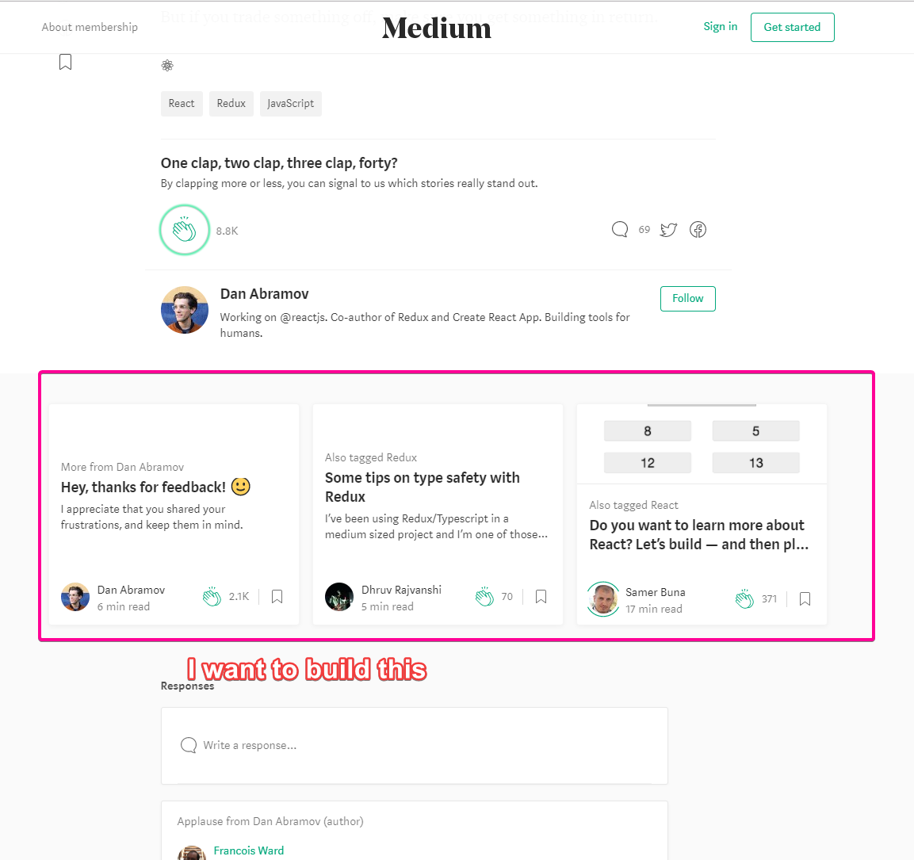
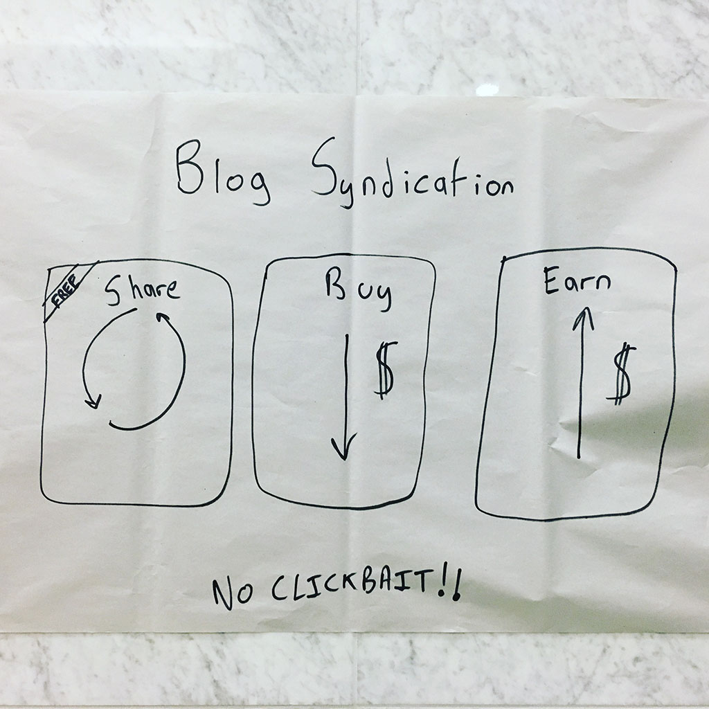
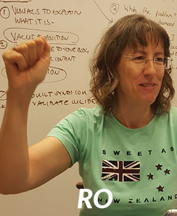
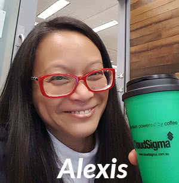
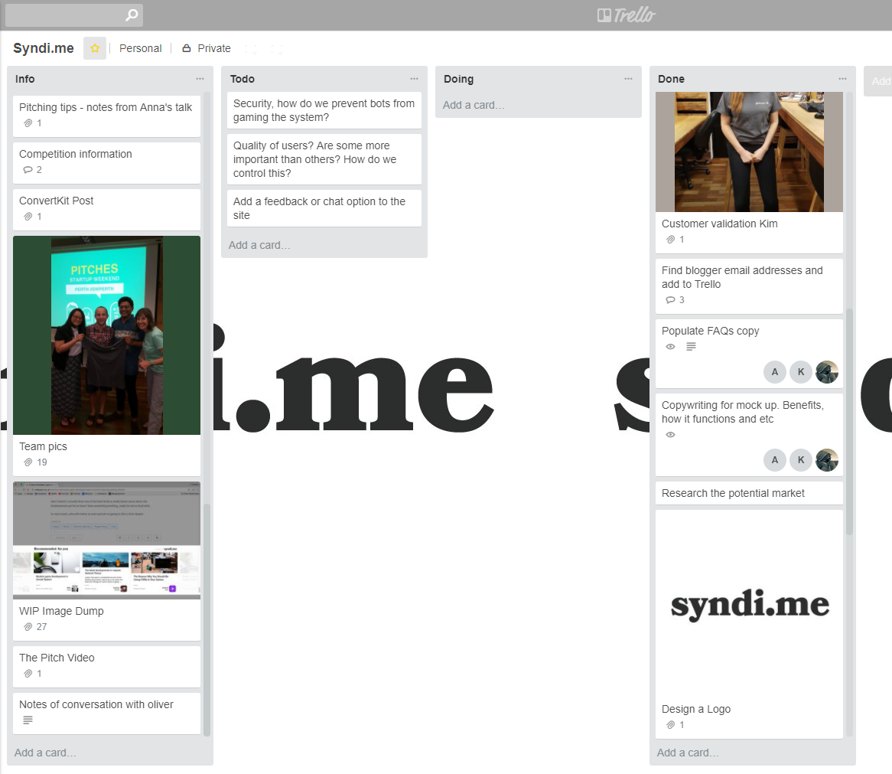
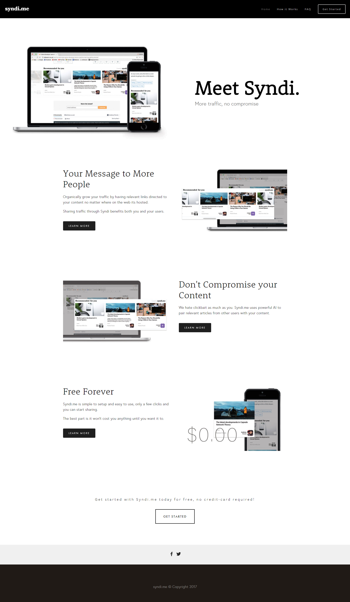
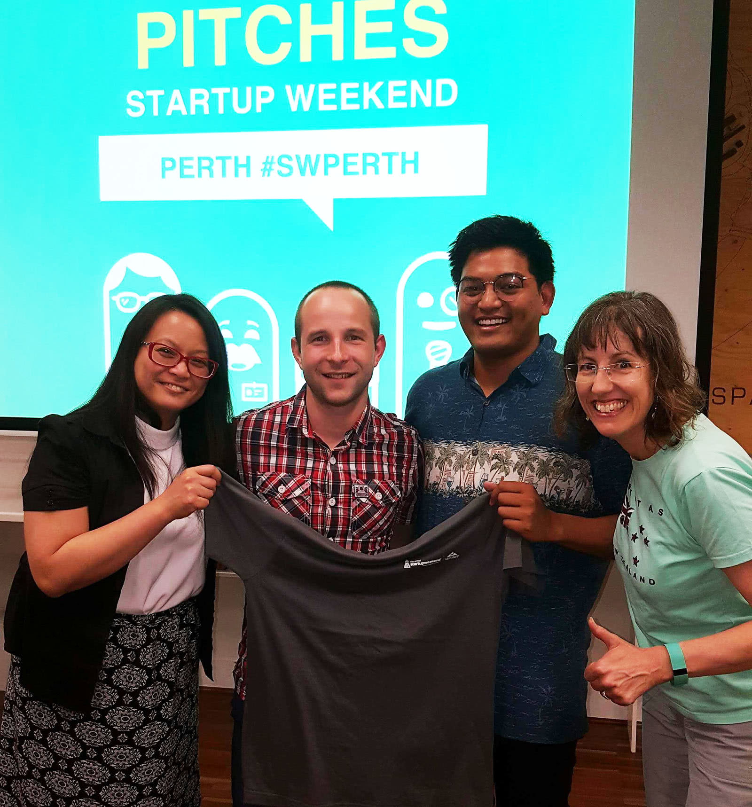

Its been a while since I have done a hackathon. I spent [half of the year](https://mikecann.co.uk/above-under/and-off-we-go/) camping my way around Australia so I guess thats to be expected. So when I saw that startup weekend was running again at the weekend I thought sure, why not.

<!-- more -->

# TLDR;

I had an idea, pitched it, gathered a team and validated an idea over the course of a weekend. I overcame some personal hurdles and came out the end with a potentially exciting business idea.

# What is Startup Weekend?

During Startup Weekend the objective is to go from idea to business over the course of just a couple of days. You form a team with total strangers and work together to validate your business and if possible build a prototype of your product.

The last time I did Startup Weekend was [back in 2015](https://mikecann.co.uk/hackathons/tuckr/startup-weekend-perth-2015-tuckr/) when I worked on a business called Tuckr that aimed to help people locate where those awesome food trucks are near you.

I remember ending the weekend that time happy but thinking that I probably wouldnt go again as it didn't really involve much technical work. It was more of an exercise in product validation than actually technical work and as I consider myself a highly technical person I didn't feel that useful.

# So why sign up again?

Often the only way to grow as a person is to get out of your comfort zone and do things that you arent good at or scare you.

I have always been scared of is standing up infront of people and presenting. Im much more comfortable sat infront of a computer in my own little word working on my own little problems.

So this time I decided I wanted to pitch an idea, form a team if people were interested and take it all the way through to the end and stand up infront of the judges and give a final pitch.

# The warm up

So friday rolls around, I rock up about 6pm, theres quite a few people there already. I have done this a few times before, I know what the deal is. I mingle around, grab a beer, chat to a few people.

Before I know it, its 7:30 and time for pitches. Theres about 90 people there and about 20 of those line up to take their turn to pitch their idea to those remaining in their chairs.

Im near the back of the queue because I want to see what other people are pitching just incase I want to chicken out and join one of them instead.

Theres some really interesting pitches from all kinds of different industries but none of them has grabbed my attention enough to stop me pitching, I guess the beer must have helped with the courage.

# The pitch

So I take the stage, I have 1 minute to explain my idea, I have practiced it a couple of times so I know that I should be able to do it in the time.

> Hi im Mike Cann, im a professional games developer but im also a blogger that has kept a blog going for over 10 years now.
>
> One of the constant problems with blogging is how do I get more people to read my posts?
>
> One solution to the problem can be seen on websites like Medium.com. At the bottom of each post is a "Reccomended for you" section that lists blog posts from other Medium.com authors.
>
> This circulates traffic between the authors on Medium.com and thus is good for everyone.
>
> But what if your blog isnt on Medium.com? Like mikecann.co.uk for example?
>
> I dont want to have to move all my posts over to Medium to take advantage of that post syndication feature.
>
> Fortunately there are alternatives. If you google this problem you will encounter Outbrain and Taboola.
>
> These multi-billion-dollar companies however are not targeted towards casual bloggers like me. You probably have seen them, they can be found at the bottom of websites like cnn.com and thewest.com.au. The recommended articles often have click-baity titles like "Details From The Set Of 'Bewitched' That'll Stun Fans" or "Mums, these workout hacks are just for you".
>
> This is not something I want next to my content.
>
> I want to build a click-sharing service for bloggers that shows relevant recommendations for my content without the clickbait.
>
> To validate this idea I need a designer and people with blogging or advertising experience.
>
> Thankyou.

# Team formation

With the pitch over I couldnt relax just yet. Now I had write a poster to attract others to join my team.

I tried to convey the basic business model in as simple a way as possible.

Well it seemed to work as I managed to gain 3 other members of the team. Ro, a fellow blogger and business woman, Alexis a writer with a bunch of blogger contacts and Andrew a designer.

So we had one developer (me), one designer to make pretty pictures and two business people with domain experience. IMO this is the perfect team!

# Planning

The remainder of the evening was dedicated to introducing ourselfs and working out how we were going to work together, what our roles were and how we were going to communicate.

One thing that surprised me during this phase was that I had to re-pitch the idea to my team again before they fully understood what it was I wanted to build. Perhaps the idea was too complex? Perhaps I didnt explain it well enough first time? Either way I must have left some sort of impression as they joined me regardless.

# Trello

I like to use Trello for organizing a project during hackathons. Well I actually like using Trello for organizing just about any project but I particularly like it for hackathons because its really easy to get started, everyone can collaborate images, files, videos, whatever at the same time and most importantly its free!

# Saturday

The following day was all about validation. I had a few things I wanted to cover.

1. Has this been done before?
2. How do Outbrain and Taboola work, what are their positives and negatives?
3. Do bloggers even want this?
4. What are we going to call our business?

Note, none of those points actually involve any development work. From previous experience I knew how time constrained we were going to be over the weekend so I decided early on all we were going to do is validate the idea, not actually try to build anything.

With me acting as leader / coordinator my time was going to be very limited for development work.

So I spent the day giving Andrew our designer direction as he began the work of building the website we would send people to try to get feedback and thus judge whether it was something that bloggers wanted or not.

I also assisted Ro and Alexis with tasks that addressed the other points. One interesting thing that came out of Ro's research into Outbrain was the fact that you needed a credit card just to sign up and get started. This is definately something I want to avoid with our business.

# Naming

We spent a little bit of time on the Saturday morning coming up for a name with ourself. We had a little bit of back and forth, we wanted something that gave a hint that we were a blog syndication service but without too many syllable.

In the end settled on "Syndi.me", its not perfect as it could be spelt in a few different ways but it conveys the information we want without being too long, and critically the domain was available!

# Syndi.me website

By the end of Saturday evening we had finished the website: https://syndi.me and posted it to a number of blogger facebook groups and sub-reddits so hopefully over the course of the next day or so we will get a little bit of feedback to see if people are interested.

We used Squarespace to build the site as its quick and relatively low cost. Andrew was very familiar with Squarespace too so that cut down the learning time.

I found it tricky to work out what copy to put on the website. How to convey the idea without being too complicated right away. Fortunately Alexis was there to help me. In the end what we went for was a simple summary, followed by more in-depth information in an FAQ page.

# Sunday

By the time sunday rolled around it was all about preparation for the pitch. Building slides and practice practice practice.

We had a number of helpful presentations from the organisers during the weekend which really honed our pitch by encouraging us to present the idea as a story.

After the 10th time practising the pitch I was feeling pretty confident that I could do it. I knew things were going to be different when I actually get up there though.

# The final pitch

So by late afternoon it was the big moment. We all took our seats as the pitches began.

I was up 5th of 11 so I had a few to watch first which was both a blessing and a curse as there were some really great pitches. Infact as a whole the pitches were much, much better than any other Startup Weekend I had been to.

So finally it was my turn. I took the microphone and got up and stood infront of the projector and 100 other people and began my rehearsed pitch..

`youtube: https://www.youtube.com/embed/jPYgKR1hGlg`

Oh dear! Not good, I almost choked on the second slide. I dont know what happened exactly I think I was concentrating on the slide before which pushed out of my head what I was going to say next, then I started to panic and that then spiralled down into more panic.

I stopped, took a breath and decided to just move on and try not to think about it.

The rest of the pitch went well so fortunately it want a total disaster.

# Judging

Once I had finished my 4 minute pitch the whole team came up on stage while the judges asked us some questions and gave us feedback.

One of the first points mentioned by one of the judges, Charlie Gunningham, was that my back was to them the whole time, whoops!

The rest of the feedback was very positive, they all thought the idea was great and couldnt believe that it hasnt been done before and we should continue it on!

# The presentations

With that nerve racking experience out of the way we took our seats once more and watched the other pitches.

Once they were all over, the judges went into the back room and conferred for a few minutes before coming out and declaring the winner.

As I mentioned above I was really very impressed by the pitches this time. There was some really great ideas and some very well presented information. Some of the groups really did an excellent job portraying their information.

I wasnt expecting to win anything considering the mess I had almost made of the pitch but to my great surprise when Chloie stood up and announced that the runner up prize went to Syndi.me I was totally taken aback. Wow we had come second! (well technically third as there was a join first prize this year)

We went up on stage to applause, was given a back of goodies, shook hands with the judges then took our seats with massive smiles on our faces.

# Conclusion

I am so glad at how the weekend turned out. I achieved what I aimed for. Pitch and idea, form a team and try to validate an idea.

I was super lucky with the team that joined me over the weekend, they were just the right mix of people with no egos. We worked together so well, and they were incredibly supportive of me even though I freely admitted I wasnt the best presenter but wanted to give it a go regardless.

So now I have to decide if I want to take the judges advice and continue our work on Syndi.me.

What do you think dear reader? Leave a comment below if you think I should continue on with Syndi.me and actually build a working solution..
