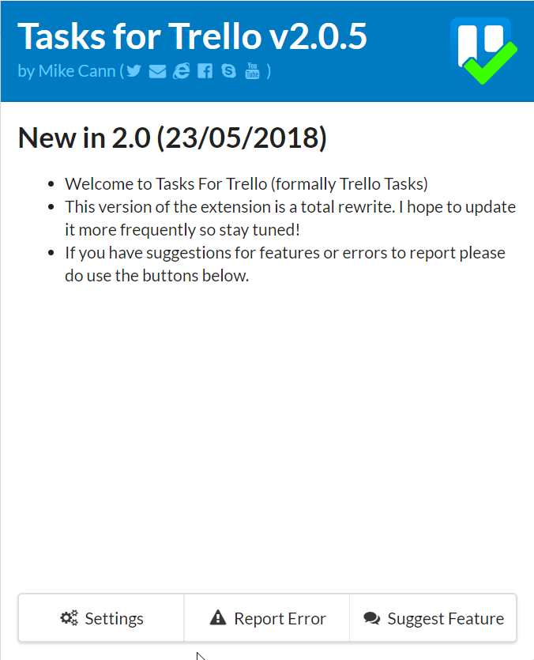
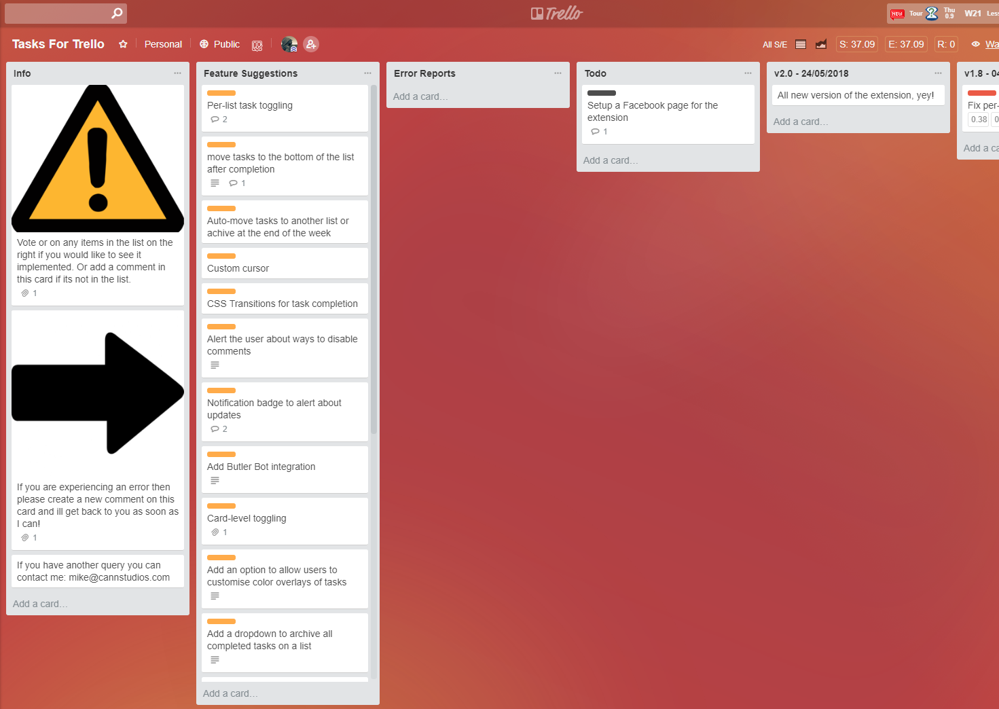

Its been a while since I wrote about my Chrome extension Trello Tasks but thats not for lack of interest in the project. At the moment it has 3,546 users and I have had innumerable requests for new features so seeing as I had to update it to comply with GDPR anyways, I thought it was time to give it some love.

<!-- more -->

# What does it do?

Well its pretty much exactly the same as Trello Tasks in functionality, so ill copy the description [from that post](https://mikecann.co.uk/trello-tasks/trello-tasks-a-new-chrome-extension/):

The TLDR; of Trello Tasks is: it augments Trello by turning Cards into “completable” tasks.

One of the most common ways to use Trello is in the "ToDo" style. In this style you have three lists, ToDo, Doing and Done:

In this style, when you start work on something, you move it from the "ToDo" List to "Doing" List then when its complete you move it to "Done" List.

This is all well and good but what if you use a different system of organisation such as arranging the items by category:

Now if you want to indicate that you have read a book or watched a movie you would have to either drag it into the "Done" list (and loose the categorisation) or create a "Done" list for each category. One other option is to "Archive" the card but doing this removes it from the list altogether.

So I decided to try and solve this very particular but annoying problem. My solution is to add a checkbox to each card. Now cards can be marked "complete" and "uncomplete" by simply checking the checkbox.

The extension works by piggybacking on Trello's comments system. So each time you complete or uncomplete a task the extension adds a comment to the card.

This means that in a multi-user board you can tell who completed or uncompleted a task and syncing "just works":

# Whats different?

Well apart from 99% of the source code being different I changed the browser action to be clearer:

I also upgraded the options significantly in anticipation of adding a bunch more settings in here:

I also gave the logging section an overhaul so you can see whats being logged and crucially download the log to send to me for analysis:

Under the covers everything is syncing to the chrome cloud store so it should work across browsers without any private servers or privacy issues to me.

# Why change the Name?

The reason why I changed the name and created a whole new extension rather than upgrading of Trello Tasks was because when I reached out to Trello to see if I could get official approval from for the extension they told me that I would have to rename the extension to "X for Trello" to comply with their branding guidelines. Well I didnt want to do that at the time as I had just spent ages getting everything setup with the name "Trello Tasks" so I decided to keep it as it was.

So this time around I decided if I was going to do a rewrite, I might as well rename the extension at the same time and hopefully finally get Trello's approval.

# Rewrite?

So the decision to do a rewrite rather than an upgrade was partly because of the name and partly because I was going to have to make changes to Trello Tasks for GDPR compliance. I also realised that Trello Tasks was built using (what seems like) ancient coding practices so I decided in my typical naïve way that I should just start again, it shouldnt take too long, right?

Well it took about twice as long as I was expecting, but I am happy with the way it turned out.

# Open Source

I decided to do this rewrite on a public Github repo. This is because a great many extensions these days are doing very shady things such as crypto mining, ad injection, ad replacement, privacy violation and other things. I wanted to be able to avoid all of that by pointing to the source and saying; "here, look at the source, you can see im not doing anything shady".

I do intend to add "donation" features in the future to help with the costs of continued work on the extension but im trusting that most people wont then download the source and create their own extension from the source.. would they?

Anyway you can check it out here: [https://github.com/mikecann/tasks-for-trello](https://github.com/mikecann/tasks-for-trello)

# Using Trello for Support

So I decided this time around to use Trello itself as the hub for the project.

People can leave comments, suggestions and error reports on that board which I will receive notifications for then update the board. Its a quick and simple way of managing the project.

# Trello Tasks Depreciation

So I also made a very small update to Trello Tasks at the same time to ad a message informing my users that Trello Tasks will be no more in a few weeks and to go download Tasks for Trello instead. I hope they all get the message!

# Download

If you are interested then you can go grab Tasks for Trello now from the chrome store: [https://chrome.google.com/webstore/detail/tasks-for-trello/cdbbpbodmdnhmbpnnmlpboepefbhiefp](https://chrome.google.com/webstore/detail/tasks-for-trello/cdbbpbodmdnhmbpnnmlpboepefbhiefp)
