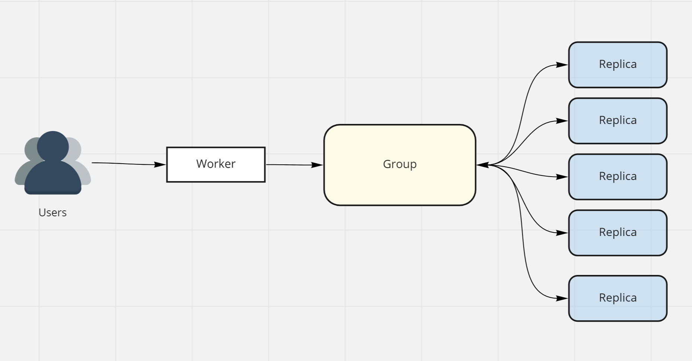
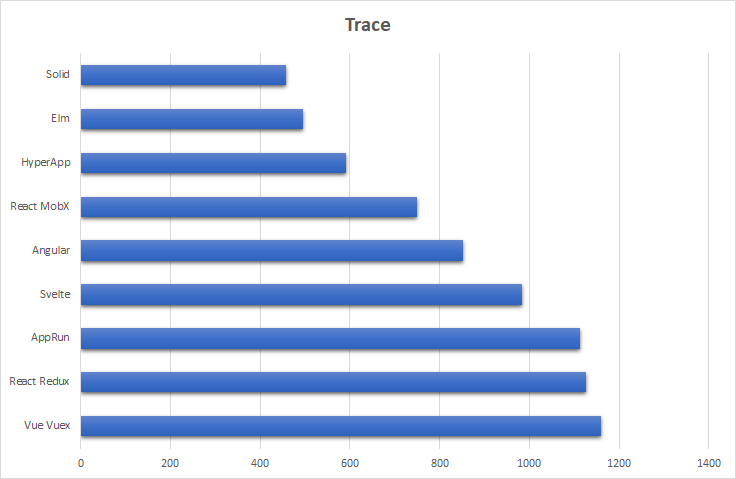

Wow how fast did 2021 go? Crazy! And we are already almost at the end of January.

<!-- more -->

I try to write at least one blog post a month but I have to admit, lately I have been struggling to find the time. A combination of more [family](https://mikecann.blog/posts/joshua-christopher-cann) and more [business](https://gangbusters.io) are the likely culprits. Whatever the reasons, it means my personal projects have taken a back seat lately.

Thats not to say that there hasn't been a heap of cool stuff that has caught my eye over the past few months and am itchy to tinker with. So I thought for this month's post I would list a few of the projects that I want to take a closer look at this year :)

# Cloudflare's DOG

[BattleTabs](https://battletabs.com/) is currently [Gangbuster's](https://www.gangbusters.io/) only title and has been in development for [a couple of years](https://mikecann.blog/posts/introducing-battletabs) now. Initially it was released as a concept. We didnt know if it would work or not so I chose the technology I knew I could get going with the fastest, which was Heroku and Postgres at the time.

Since then the game has grown and the requirements have changed as we added new features. We have faced a number of challenges on Heroku and it is a continual worry of mine that the servers will fall over one day or run out of capacity when im on holiday or something. There is also the significant cost associated with Heroku compared to the alternatives.

Ideally we would move to a tech stack that supported infinite scale and not have the same operational concerns. An obvious choice would be a serverless tech stack.

The issue with a serverless stack for us would be the lack of a websocket connection to the client for realtime game updates. We need these capability to provide a great game experience for our players without resorting to less-than-optimal (and expensive) rapid polling.

[AWS does have the ability to use websockets with API Gateway](https://aws.amazon.com/blogs/compute/announcing-websocket-apis-in-amazon-api-gateway/) but when I last ran the numbers it was going to be fairly expensive and there were some significant limitations.

So when I heard about [Cloudflare's Durable Objects](https://developers.cloudflare.com/workers/learning/using-durable-objects) and their [ability to handle websockets](https://developers.cloudflare.com/workers/learning/using-websockets#:~:text=%E2%80%8BDurable%20Objects%20and%20WebSocket%20state&text=Durable%20Objects%20are%20a%20coordinated,learning%20page%20to%20get%20started.) and could do it in a [cost effective manner](https://developers.cloudflare.com/workers/platform/pricing#durable-objects) (you only pay for the message handling time) I became excited.

[In October](https://mikecann.blog/posts/serverless-databaseless-event-sourcing) I tinkered with Durable Objects to build a serverless Event-Sourcing application. This worked well but I ran out of time to try the websockets potential of the technology.

Because a single server / Durable Object can only support a limited number of connections was I needed was a way to automatically "fan-out" incoming connections to "children" automatically so that each server managed only a few thousand connections while still able to communicate with the others in the Group.

Fortunately thats when I stumbled across [Cloudflare's Durable Object Groups](https://github.com/cloudflare/dog) (DOG). This is an experimental project that does just that. It takes incoming connections and fans them out to multiple "Replicas", scaling up or down the number of replicas as a needed.

I was thinking it would be cool do make a really cheap version of [Pusher](https://pusher.com/channels/pricing) using this :)

# FaunaDB

I have had my eye on serverless databases for some time now. When working in a serverless context you generally cant use databases that have heavy permanent connections such as Postges or MySQL. [Cloudflare Workers use V8 Isolates](https://developers.cloudflare.com/workers/learning/how-workers-works) which basically means that if it cant run in a web page then it cant work on Cloudflare.

So there are a number of alternatives out there such as DynamoDB, CosmosDB, Firebase, CockroachDB, MongoDB etc. They are all however either too simple (DynamoDB) or too expensive (Cosmos, Firebase) or I simply dont like using them (Mongo). [FaunaDB](https://fauna.com/) however caught my eye with its Document-but-still-Relational nature and its interesting querying options.

Thus far I have listened to a few podcasts on the technology and read a few articles and the following are some of the more interesting points for me:

## Scale & Cost

Even though DynamoDB is famous for its scaling potential there [is still a lot of operational complexity](https://docs.fauna.com/fauna/current/comparisons/compare-faunadb-vs-dynamodb#scalability) one has to worry about with scaling its usage. I like Firebase's fire-and-forget approach to scale but even it does have its limitations at upper bound of number of connections and key contention.

I havent dug very deep into this part of Fauna yet but im excited to see that [it scales](https://docs.fauna.com/fauna/current/comparisons/compare-faunadb-vs-dynamodb#scalability) with ease much like Firebase.

## GraphQL

Fauna has a number of interesting ways it can be queried including its own functional query language [FQL](https://docs.fauna.com/fauna/current/api/fql/). One option that has me curious is its [GraphQL querying option](https://docs.fauna.com/fauna/current/learn/quick_start/gql_quick_start).

If this works as advertised then it could indeed make some DB access operations much simpler. They have even solved [the n+1 problem](https://fauna.com/blog/no-more-n-1-problems-with-faunadbs-graphql-api) for access which is super cool tho I wonder what access patters it prohibits (joins?).

# SolidJS

I first heard about [SolidJS](https://www.solidjs.com/) a number of years ago and remember being impressed at its tiny file size and its [supposedly awesome performance](https://levelup.gitconnected.com/a-solid-realworld-demo-comparison-8c3363448fd8).

At the time however I as perfectly comfortable with React and felt like its performance was just fine on my machine. Having worked on [BattleTabs](https://battletabs.com/), a large React app, for some time now I am feeling the pain of slow updates and large initial page load. Many of our users run on low-performance devices and thus experience this pain even more.

So the promise that SolidJS can both be a tiny download AND have incredible performance while staying familiar to the React-JSX-like way of developing has me very much intrigued.

I have worked my way [through their excellent tutorial](https://www.solidjs.com/tutorial/introduction_basics) and read a number of posts on the library and am ready to give it a shot.

The only thing I think it is missing is some NextJS / SveleteKit / RemixRun like server-side-all-batteries-included framework. [I hear that this is in the works however](https://github.com/solidjs/solid-start).

# Roc

[Roc](https://www.roc-lang.org/) is a programming language that captured my interest last year when I [watch](https://youtu.be/vzfy4EKwG_Y)e[d](https://youtu.be/6qzWm_eoUXM) a [num](https://youtu.be/cpQwtwVKAfU?t=75)b[er](https://youtu.be/ZnYa99QoznE?t=4790) of talks on the language.

Its a purely functional language heavily inspired by [Elm](https://elm-lang.org/) but unlike Elm intended to be multi-platform and thus run on the server not just the web.

I have been interested in functional languages for some time now and have tried to get into Elm on a number of occasions but other things kept getting in the way. I however really like the look of Roc which is taking the best of Elm and building on it in some pretty innovative ways.

I also have my eye on [F#](https://fsharp.org/) having [read much](https://www.amazon.com.au/Domain-Modeling-Made-Functional-Domain-Driven/dp/1680502549) on the language. Also [Clojure](https://clojure.org/) and [Elixir](https://elixir-lang.org/) are very interesting to me.

I have a lot of thoughts about functional langues and functional style in non-functional languages like Typescript but perhaps I should leave that to another post. Let me know in the comments if you would like to read more on that.

# Orleans

I have been interested in the actor model for quite some time and find it a fascinating way of building distributed systems that scale. I have read a whole heap about [Akka](https://akka.io/) and Akka.net and am keen to try both of those out.

[Orleans](https://dotnet.github.io/orleans/) from Microsoft Research takes many of the great concepts from Akka but expands and simplifies them. It touts itself as a "Virtual Actors" system and basically doesnt require explicit messages as Actors can communicate using simple function calls as if they were running as standard objects in memory with each other.

It reminds a bit of "true OO" like that found in [Smalltalk / Phaero](https://pharo.org/) but for the the .net ecosystem and distributed server-side computing.

Its a very interesting technology and I want to give it a try soon!

# Joshie

Finally this one isnt a tech project at all but still something that I hold dear to my heart. This little man is growing up so fast and I am incredibly conscious about not letting these precious moments pass me by while I have my head stuck too deep into one of my projects.

Time is passing so fast it wont be long before he gets curious about what daddy does for his work and I hopefully will have a whole new set of projects to tinker with together :)
