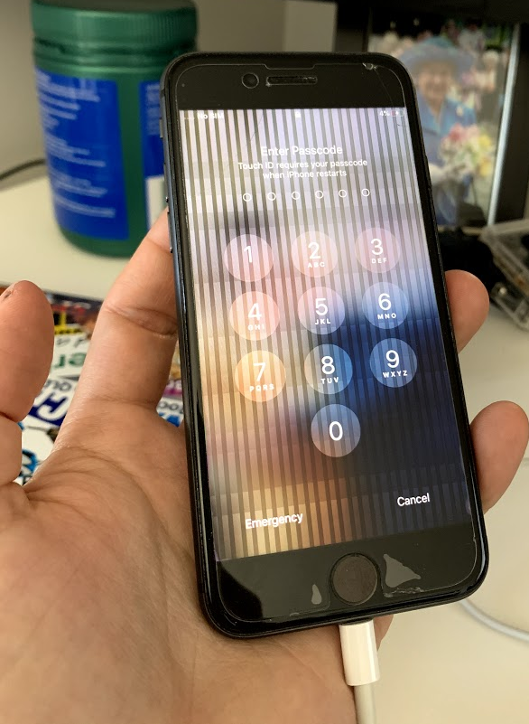
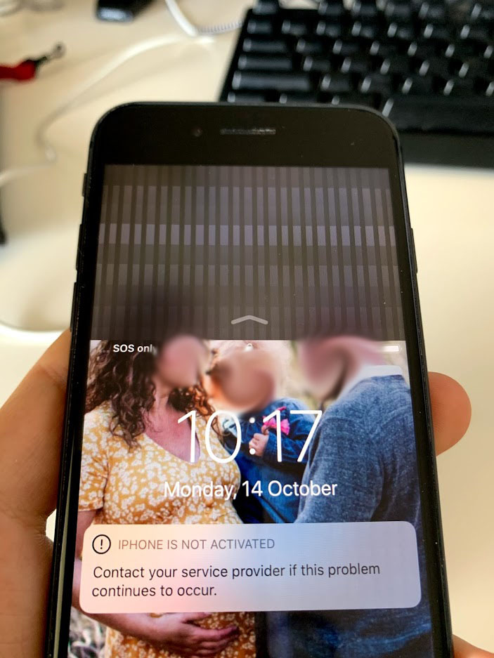
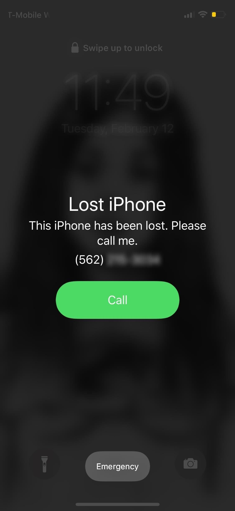
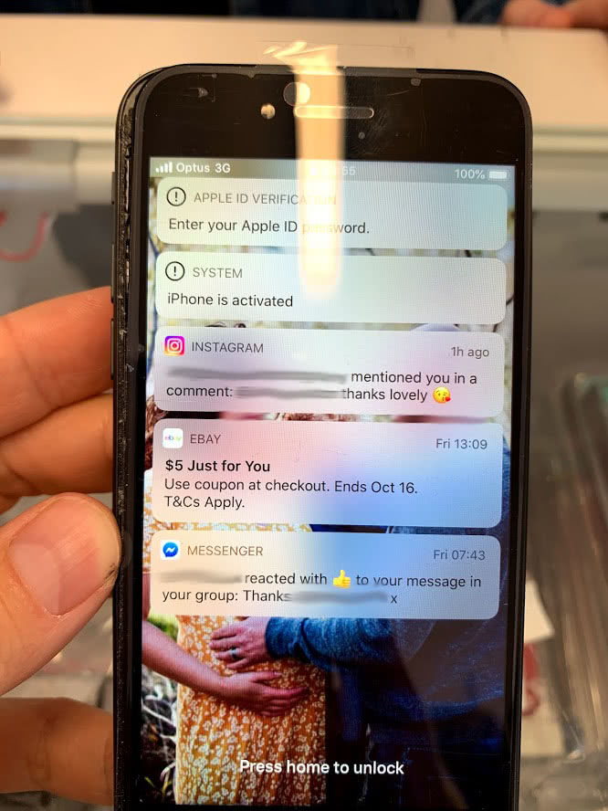

Todays post is a little different from my usual technical or business related posts, its a tale of search and discovery..

<!-- more -->

# TLDR;

<iframe width="853" height="480" src="https://www.youtube.com/embed/4r3j5qWkO34" frameborder="0" allow="autoplay; encrypted-media" allowfullscreen></iframe>

I was contacted to give an interview by Dariya Salmin of ABC's South West Radio show "Mornings" about the found iPhone, give it a listen if you dont do readin' :)

# The Discovery

A few weekends ago it was an unusually hot spring day here in Western Australia and we were on a weekend break at the seaside town of Busselton. As it was so warm I decided to head down the beach for an early-season swim under the famous Jetty.

I had a fantastic swim, there wasn't anyone else down there and the water was full of fish hiding under the jetty.

<iframe width="853" height="480" src="https://www.youtube.com/embed/YeOIC7A582M" frameborder="0" allow="autoplay; encrypted-media" allowfullscreen></iframe>

So there I was happily swimming along when I noticed something sticking out of the sand. I swam over and to my surprise it was an iPhone..

(An artists impression of the discovery)

Now this actually wasnt the first time I had found a phone under the Jetty. I had previously found one further down towards the end of the jetty that had obviously been there for some time and was heavily corroded.

This one looked pretty new however so I surfaced and looked up at the jetty to see if I could see anyone looking down as if they had just dropped it, but there was no one up there. Expecting it to be broken anyways I just put it in my pocket and continued by swim.

It wasnt until I returned to the beach that I took a closer look at it and to my surprise it was still on but incredibly glitchy, the screen wasnt really comprehensible.

(this was taken some time much later and looked far worse than this at the time)

Fearing the damage I was doing to its internals with it on I decided to quickly turn it off.

# Repair

After getting it home I put it in a glass of rice for a day to hopefully dry it off as much as possible. I then plugged it in with fingers crossed that it would still turn on. Sadly not, it wouldnt charge.

Expecting the worst I decided to take it to a mobile phone repair shop and see if anything could be done. If I could get it working again I would try to find the owners and return it, otherwise I would see if I could sell it and repair my own broken iphone.

After a \$40 inspection the phone repair shop declared it "buggered" (or a word to that effect). It was totally salt damaged inside with salt corroding all the contacts and components. Dejected I returned home.

A week or two later I found it in my drawer and thought to myself why not just try plugging it in one more time, not expecting anything I attached the cable and returned to work. About 5 minutes later to my great surprise I saw the screen light up and turn on!

(faces blurred for privacy)

The screen was on but unfortunately it appeared as if the touch part of the display had been corroded and no longer functioned. Fortunately it was an iPhone 8 and so had a physical home button. Pressing the button revealed a very cute picture of a couple and child, I bet they had tons of more pictures on there that unless they had a backup, they would dearly want back, I had to find a way to return it.

# The Hunt

I thought I would try doing a reverse image search for the picture of the couple to see if I could find them that way.

Nope, but if you ever wandered what love looks like, this is it apparently!

So it looked like they had either cancelled their contract or the sim card was broken. I knew that if I could get it connected to the internet somehow then they may have set a lost message via iTunes.

So I took another trip out to the mobile phone repair shop and see if there was anything I could do. They took it apart again and found that replacing the screen would make it touch again, so that was an option.

The other thing I could do was put my sim in it an see if that worked. If it did then the sim tray wasnt broken, it was just the original owners had cancelled their contract for the phone.

So I did just just. After a few minutes it connected to Optus and then to my surprise a bunch of notifications turned up on the phone and they weren't obscured!

So I now had an instagram, ebay and fb messenger notification to go on. I thought that the FB message might be my best bet so I quickly searched for all the people with the the name mentioned in the message asking them if one of their friends had lost an iPhone.

I then thought hang on no, that instagram message was replying to a comment left by whoever had lost the phone so the person being replied to with the @ is the owner of the phone!

I quickly looked them up on instagram.

Huzzah! I had found the person! But the account is private, where do I go from here? There is no way to contact them.

Then I remembered that Instagram in their infinite wisdom only allows a small subset of functionality on their website, so I fired up Instagram on my iphone and looked the person up and yep sure enough I could send them a private message.

# The Return

I sent them a prive message letting them know that I think I had found their phone and asking them to call me. About 5 minutes later I received a call, and relayed the whole saga back to them. They were incredibly grateful as they weren't sure if the photos were backed up or not.

They came over that afternoon to collect the phone, paying me the $40 that it cost me for the inspection and $10 on top to say thanks. Not enough to get the screen repaired on my phone but thats okay, im glad they got their phone back with all their valuable pictures on it :)

# Conclusion

Im really surprised that the phone still worked after sitting at the bottom of the sea for a while. Im even more surprised that it turned on again with all that salt build up inside of the phone. Im even more surprised that the owners didnt have obscured notifications on the lock screen and they they hadnt remotely locked the phone.

Its this fortunate series of surprises however that allowed me to work out who the phone belonged to and eventually return it!
