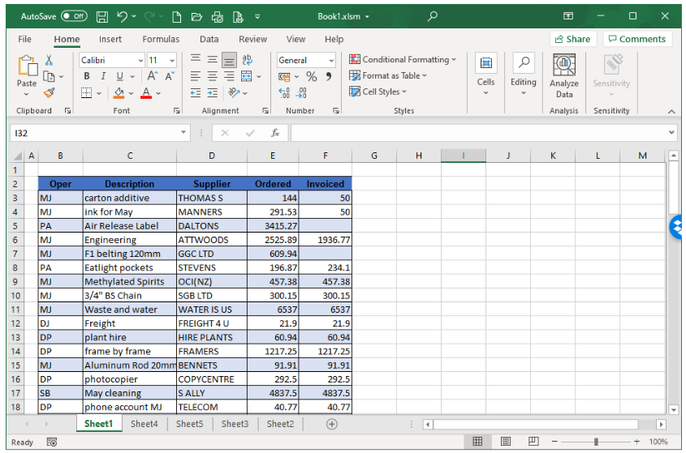
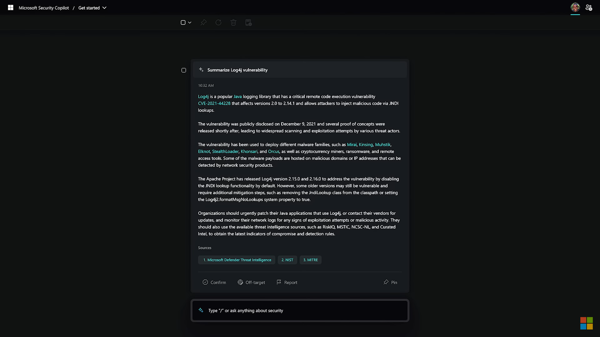
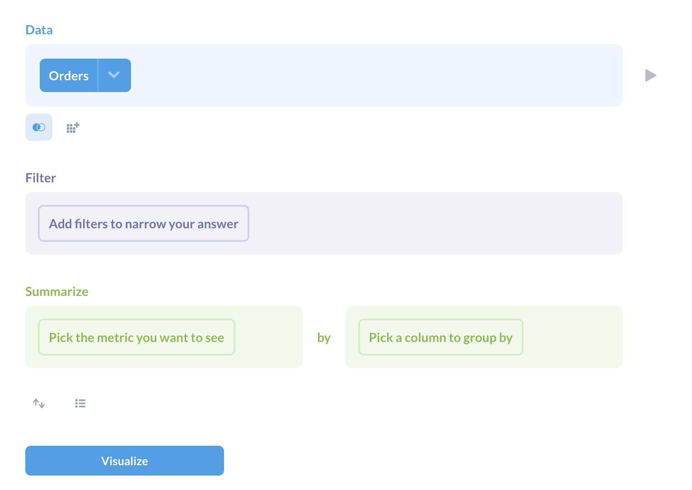
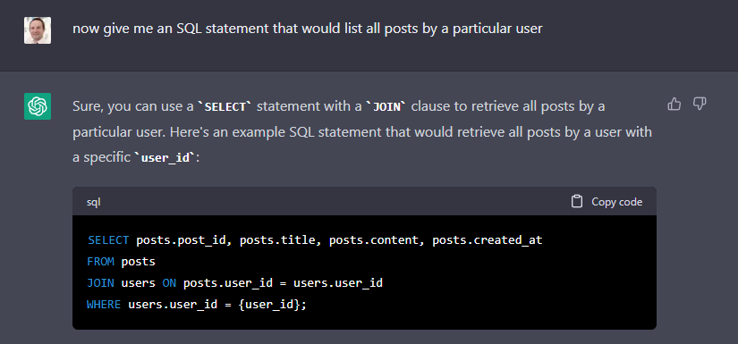
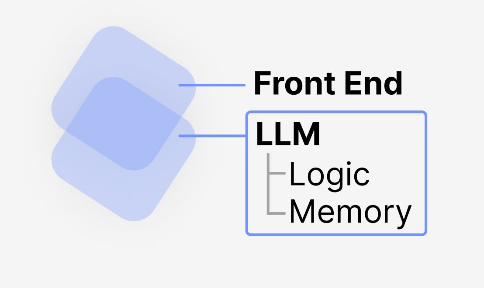

I wrote my first Application 31 years ago when I was [7 years old](https://mikecann.co.uk/about). Since then I have spent most of my career learning the fine art of of crafting clean code. From hand-crafted HTML and CSS to wrestling with MXML and AS3 I have been doing this for a long time.

With the incredible advances in Large Language Models (LLMs) and their ability to generate code on demand i'm starting to wonder if the days of hand-crafted applications are numbered.

# What is a LLM?

You must have been living under a rock if you haven't heard of ChatGPT over the last few months, but just in case you are a granite hermit:

> A LLM is a large neural network that has been trained on a large corpus of text. The most famous of these is [GPT-3](https://openai.com/blog/openai-api/) which has been trained on 175 billion words of text. The idea is that you can feed it a prompt and it will generate text that is similar to the prompt. For example, if you feed it the prompt "Describe the life and work of Albert Einstein", it will generate a text that provides information and details about Einstein's life and contributions to science.

(yes the above was generated using a LLM)

# What is an Application

For the purposes of this post, let's say that an application is made up of three parts:

1. The persisted state or "data"
2. The interface into that data (API). This is generally your "server".
3. The User Interface that makes use of the API. This is generally your "client"

I think that each of these parts is going to undergo a massive transformation thanks to the recent AI advances.

As its most familiar to most people lets start with the UI.

# What is a UI?

A UI is a User Interface. It is the thing that you interact with to use an app or program. Almost every app has one, think excel or discord:

The only real examples I can think of that don't are things like CLIs (Command Line Interfaces), but even then its arguable if a CLI even if its just text based.

One way to think about them is they are the visual front end on whatever business logic and data that makes up the core of you application. It allows you to query and mutate that data in a way that is easy for the user to understand.

# UIs of Today

Current UIs are generally hand-crafted by humans to look and feel a certain way. These usually are a very labour intensive pursuit on the behalf of the developer.

If you don't like or understand the particular design of a given UI, you are generally out of luck because that's the way it's been developed.

# UIs of Tomorrow

Back at the start of [November 2022](https://mikecann.co.uk/posts/ai-and-the-future-of-game-development) I wrote a post on how I thought AI would change the future of game development. In that post I talked about how I thought that the future of app development will feel more like sculpting than coding.

> I have spent so much of my career thinking about and worrying over the best practices for programming. Am I correctly implementing the SOLID principles in OO C# or and I fully understanding the Monad or ADTs in Functional Programming? In the future IT DOES NOT MATTER. The output is the only thing that matters.

> I think about the future of programming more as sculpting. You start off with a blank slate then using your own words you command by command iterate towards your end goal.

This was only five short months ago, but so much has happened since then. ChatGPT was released and became [the fastest growing user base of all time](https://www.reuters.com/technology/chatgpt-sets-record-fastest-growing-user-base-analyst-note-2023-02-01/).

The world suddenly realized that you can get a long way with just a text-based conversation via a chat window

This revelation caused [Microsoft to double down on their investment into ChatGPTs creator OpenAI](https://www.afr.com/technology/microsoft-invests-14b-in-chatgpt-maker-openai-20230124-p5cex0) and to very rapidly [begin implementing chat-like interfaces](https://blogs.microsoft.com/blog/2023/03/16/introducing-microsoft-365-copilot-your-copilot-for-work/) into all their products.

You can now simply ask an assistant for information using natural language, and it can go out to the web, find that information, summarize it, and contextualize it within a few seconds. This has many questioning why would you ever need to use a search engine?

Well, this combined with the double-pronged threat of vastly reduced cost of producing generated fake but believable content, caused Google to [declare a "Code Red"](https://www.forbes.com/sites/davidphelan/2023/01/23/how-chatgpt-suddenly-became-googles-code-red-prompting-return-of-page-and-brin/?sh=720f5a2b5977) to [frantically rush](https://www.reuters.com/technology/google-ai-chatbot-bard-offers-inaccurate-information-company-ad-2023-02-08/) to catch up.

These new new LLMs aren't just good at generating text however, they are also really good generating code too.

So what has all this got to do with User Interfaces? Well if you put it all together im imagine a world where an application is simply its data and an API. The User Interface is generated on demand by a LLM.

For example take a look at Microsoft's recent [release of Security Copilot](https://www.reuters.com/technology/google-ai-chatbot-bard-offers-inaccurate-information-company-ad-2023-02-08/):

<iframe width="853" height="480" src="https://www.youtube.com/watch?v=g1HoXNoP3V0" frameborder="0" allow="autoplay; encrypted-media" allowfullscreen></iframe>

The UI for Security Copilot is simply a chat prompt. The has a conversation using natural language to get the information they need.

The requested information is returned and decorated using Microsoft's own user interface controls and styling.

I believe this is just the start of what is going to happen.

Imagine instead of simply returning the information requested, the AI that lives inside your application will also return some UI code that can be used to render that information.

It's important to note that this code might be made up of building blocks that the developer has specified so that the application retains the same look and feel. This however isnt entirely neccessary as the LLM will know how to generate a good UI to represent the information that it contains.

In this future applications become much more personal and are tailored to the way you want them to work.

Sure there are going to be occasions where you just want to get the experience that the developer intended, I can imagine there might be some pre-defined layouts but then you are free to customize it to your hearts desire.

We [at Gangbusters](https://www.gangbusters.io/) use the excellent tool [Metabase](https://www.metabase.com/) to query and visualize our data.

Its a fantastic tool with a great interface for "asking questions" of your data and then visualizing the results.

But it could be better, what if you could just use natural language to ask those questions and instead of simply showing a predefined pie chart or graph, instead it could tailor the UI to whatever best suits the data. It could provide buttons and controls to allow you to manipulate the data.

This general thing is how I imagine application UIs will work in the future.

If we take it to its logical conclusion then perhaps the operating system's UI itself is generated dynamically on demand. There are no "applications", the AI that runs in the OS simply goes out to the various services on behalf of the user, returns with the data and generates a UI to display it on the fly.

# The Future of APIs

This is a bit of a tangent but:

UIs need to render some data to the screen. They get that data from a data source that they interface with using an Application Programming Interface (API).

A normal website is a UI that is communicating with one or many servers via an API generally REST or GraphQL.

These APIs are generally written by humans so that they are easy to understand by other humans.

In the age of generated UIs I think this will change. APIs no longer need to be written for human consumption primarily they can instead by written for machine consumption. This will mean a lot less work for the developer that has to create and document an API for other humans to consume.

Perhaps the API will simply be a text prompt. You will in natural language simply ask for the data and then an AI that lives in your application will understand that, convert it into an SQL statement and then return the data to the UI.

We can add "system" prompts to our AI to ensure that it doesnt return any private data or allow it to manipulate data in any undesirable ways.

# The Future of Data Storage

So you have an AI generating your UI and the API is simply a prompt, whats left? Well just the data storage part.

In the section above I imagine a future where an AI is able to generate an SQL query to interrogate an existing relational datasource such as Postgres. But what if we took that one step further.

What if we wanted the data storage to be more flexible so that as the application evolves the new structure of the data can be stored correctly?

Currently we have to define migrations to modify the schema of our database as the application evolves over time but what if instead data was stored in a less-structured NoSQL like manner. Now your data storage can change over time without and migrations.

The AI can still write NoSQL queries to access the data and it could also record a "dynamic" schema that it uses before it queries the data source.

Now if we take that another step forward, what if the AI is able to run in the background and spot inefficiencies in the way the data is structured and restructure it on the fly?

In this world you no longer know how your data is stored as the AI has organized and evolved it as your application has evolved.

But we can take this a step further. What if your data isn't structured at all? This is a future suggested [by @DYtweetshere in January](https://twitter.com/DYtweetshere/status/1617471632909676544?s=20).

Instead the the AI "backend" simply "remembers" all the previous prompts ever given and is able to infer structure and meaning from that data as new prompts come in.

This is the ultimate in storage flexibility as there is now no longer and structure to your data, it is instead simply a list of strings.

Now this final example will take a few more advances in model context size as the AI must keep everything ever muttered in its "memory" so its can draw meaning from it without querying it. For a large app this is currently infeasible, but I suspect possible in the future.

The other potential is it stores a "compression" of the data via weights in exactly the same way the AI itself is trained but that by its very nature would be a lossy mechanism and thus your stored "Todos" (for example) would only have a probability of being recalled exactly which might not be ideal.

# Conclusion

For the past 31+ years I have been making applications in generally the same way. Hand-crafted some code for the UI, API and Data store, refine and repeat. I think this age is finally coming to an end.

I think the next few years are going to see some of the biggest changes in the way applications are created and consumed. More so than the cloud computing revolution, more so than even the mobile computing revolution.

I for one am excited about the potentials for these changes and look forward to what the future brings!
