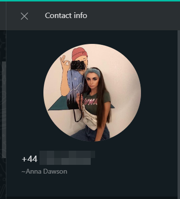
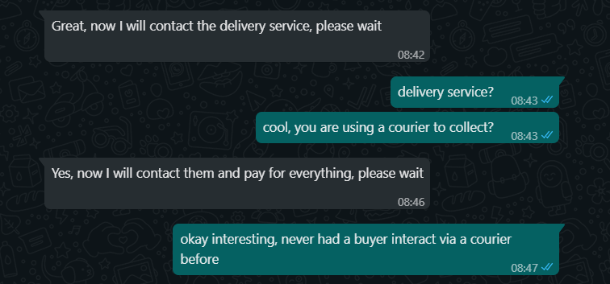
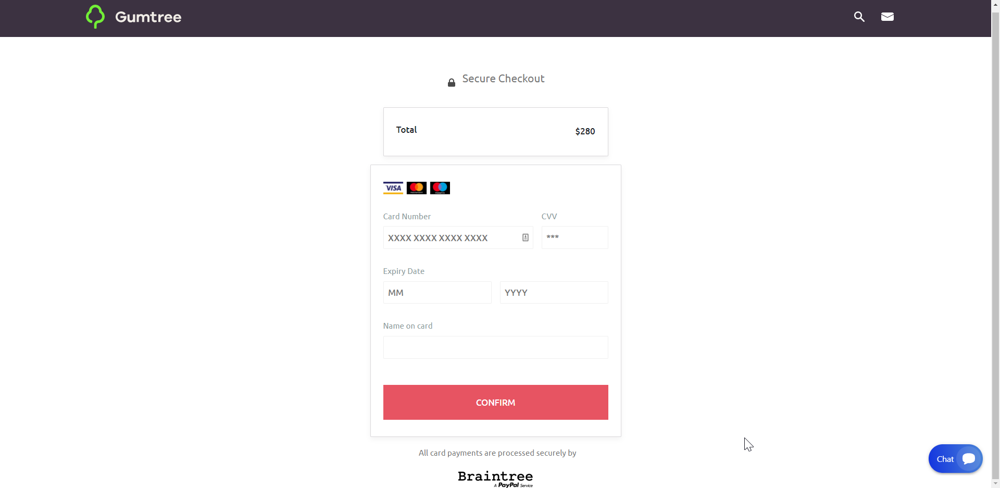
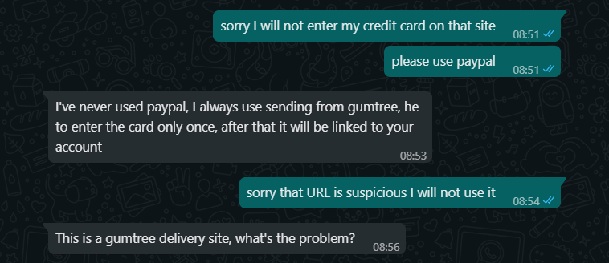

This post is a little different to my usual but the incident had me thinking so I thought I would share..

<!-- more -->

# The Journey

I recently upgraded the CPU in my PC so I decided to sell my old CPU on popular Australian second-hand marketplace "Gumtree".

To my surprise less than an hour later I received a message on WhatsApp.

I thought this was a little unusual as Gumtree buyers usually contact via the website, email or sms, they have never used WhatsApp before.

Interested I took a look at their WhatsApp contact info:

She looked friendly enough, rather attractive, not who I expected to be buying a second-hand CPU (apologies for the sexist stereotype) but there are lots of girl-gamers out there these days I presumed, or perhaps she was a an artist / creator of some sort given the camera in the picture.

I probably should have noticed "+44" (UK) based prefix on her phone number at this point but im ashamed to admit I didn't.

I chalk it up to excitement in potentially finding a buyer so quickly that I overlooked this immediate red flag and decided to continue on with the conversation..

Any subconscious suspicion I might had had was now gone as this appeared to be a very normal Seller / Buyer Gumtree conversation.

Sure, I could have picked up the fact that she referred to the CPU as a "he" and the strange grammar of "At any time convenient for you" but I presumed non-english-primary-speaker or simply typo.

Her last message however peaked my interested. What did she mean by delivery service?

I thought perhaps she wanted to use a courier because of COVID or perhaps because she was a professional Gumtree trader and didn't have the time to go collect from everywhere. Again I probably should have been suspicious about this but I wasn't, I was more curious about this than suspicious.

But then came the hook..

Incredibly I still wasn't suspicious. Even when I clicked the provided link..

This all looked legit tho I hadnt ever used or heard about a Gumtree payment mechanism. I still wasnt suspicious because a feature like this to to facilitate easier payments and dispute resolution made sense for Gumtree and it made sense that she would use it if she was a professional Gumtree trader.

So I clicked the claim button..

They need my credit card? Okay well fair enough I thought, I hadn't ever entered my credit card into Gumtree before so its needed it to facilitate the payment from the buyer to me...

So I flipped open my wallet and extracted my credit card and was about to enter my details..

It was at this point I FINALLY took a proper look at the address bar.

Padlock, that seems like a good sign but unfortunately it has nothing to do with domain authenticity these days. It only means that the connection between me and the site is encrypted and thus no man in the middle attack going on.

Lets continue looking..

"Gumtree.au" okay that seems legit. Hang on tho, thats not the domain, its just the subdomin. The domain is actually "3dsconfirme.site"..

Hmmmm... This doesn't seem quite right.

It finally landed in my head. I was probably being scammed.

I wasn't 100% sure however and I didn't want to seem stupid in front of this girl (no doubt all part of the ploy), so I went back to her with:

I was almost certain at this point that I was being scammed but I gave her just one more chance. I knew that if this was indeed a valid Gumtree payment feature then there must be a way to see this payment request from the Gumtree interface.

Ye so the jig was up at this point, I was convinced that it was all bull and had barely dodged a $280 scam.

# Conclusion

I am very impressed at how targeted this scam is and how realistic it is to the point it very almost got me. Me who I consider to be fairly savvy with computer security.

Past attempts at Gumtree scams against me have involved a text message that included a URL. This made it super obvious that it was a scam. A normal buyer would never just open a proceedings with a link to the URL.

This however felt lke a regular Gumtree buyer / seller conversation. It wasn't until 16 messages in that the hook to the fake payment site was dropped.

What worries me is that this is just the start of this sort of ultra-targeted scam. I suspect with the advent of [GPT-3](https://en.wikipedia.org/wiki/GPT-3) and similar AI techniques the scammer is only going to get more sophisticated and more automated allowing them to hit more targets in a shorter time and scamming, its just a numbers game.

Anyway, I hope this post serves as a warning, keep your guard up even tech-savvy people can be fooled!

P.S. I just noticed that Google has started flagging that domain as "Deceptive". This is great but it was not the case while the scam was being run on me otherwise I would have backed out much sooner.

