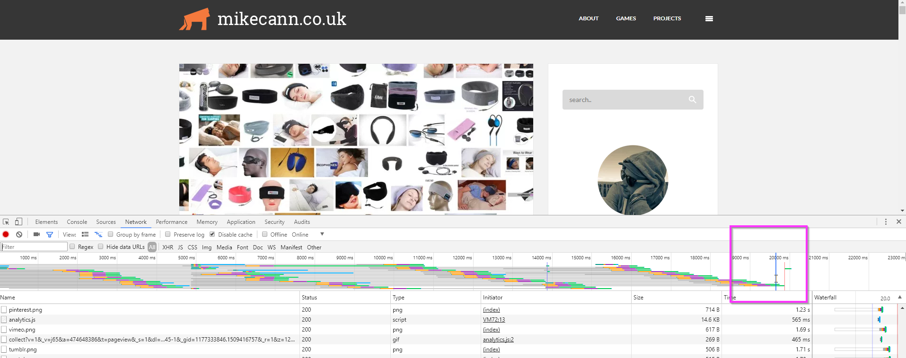

For too long I have suffered from a slow blog. Im currently inbetween project so I decided it was finally time to change that.

<!-- more -->

For many years https://mikecann.co.uk has been a Wordpress blog. This has suited me just fine up till now. Its flexible and simple enough for me to chuck up new posts with ease. Infact it has served me so well that over the [14 years](/all-archives/) of operation I now have over 520 blog posts.

The performance of the blog however never was particularly great. I tried experimenting with a number of caching plugins over the years but none really helped... but it was just about good enough for what I needed.

The performace really started to become an issue however when I moved to Australia. The issue is that the servers hosting the wordpress blog are all in the UK so the further away you are from there, the slower things got. So if you are Perth Australia, it would take 20 seconds for the homepage of mikecann.co.uk to load..

I put up with this for a while but I decided, its 2017 and I am kind of jealous of the speed of all these "minimal" blogs on Medium and Ghost, so I really should do something about it.

The key to getting lightning performanmce I knew, was to get things on a CDN. The first step in making this possible was to ditch Wordpress and go with a static site generator, that way I could avoid all those costly round-trips back to the UK by hosting everything on a CDN.

There are lots and lots of options for static site generators out there and to be honest I didn't do a huge amount of research before I stumbled across [Hexo](https://hexo.io/).

Hexo is a Node based static site generator. I chose it over the others because im really familiar with node and thus if I got into trouble I should be able to dive into the source and see whats going on.

I also chose Hexo for its large number of existing [plugins](https://hexo.io/plugins/) and [themes](https://hexo.io/themes/), many of the other generators dont have these so I would have to code up many of these features myself.

With that in mind, I grabbed the [wordpress migrator plugin](https://github.com/hexojs/hexo-migrator-wordpress) and the [Tranquilpeak theme](https://github.com/LouisBarranqueiro/tranquilpeak-hexo-theme) plus a few personalization tweaks and generated this site.

Once done I uploaded it all to AWS S3, then put CloudFront CDN infront of it and tada! Super Fast Blog!

Im really happy with the end result, page navigation is super fast. I have [archives](/all-archives/), [tags](/all-tags/), [rss](/atom.xml) and even [search](/#search) powered by Algolia!

All the source for the blog can also be found on github: https://github.com/mikecann/mikecann.co.uk

There are a few minor niggles such as post creation is not quite a nice as wordpress (but it looks like I may be able to [solve that](https://github.com/netlify/netlify-cms) in the future) and its quite slow generating a blog of this size (but a CI should be able to take that pain away when I get time).

Oh by the way you still want to access the old site at http://wordpress.mikecann.co.uk though im not sure how long ill keep that around.
