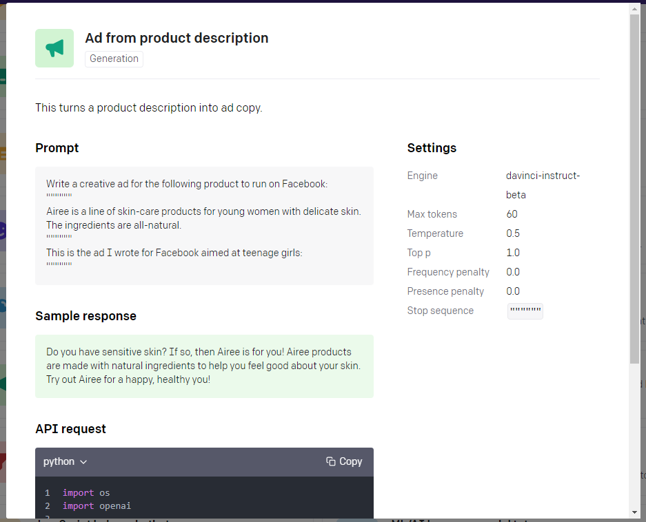
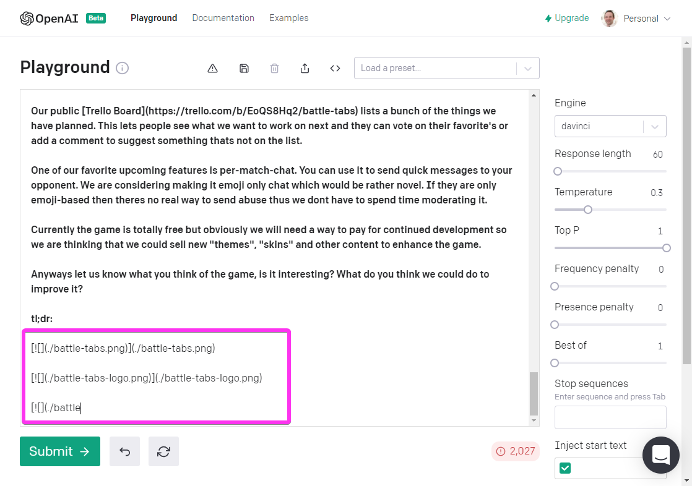
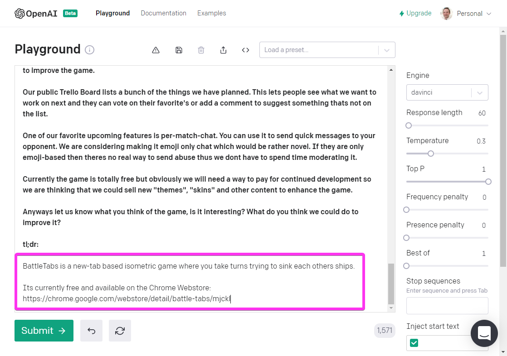

Back in in the before-times of May 2020 OpenAI made a [stunning announcement](https://openai.com/blog/tags/announcements/) about the capabilities of their latest project named GPT3. When I saw [what it was capable of](https://beta.openai.com/) and it was going to be turned into an API I knew I was going to have to tinker with it!

<!-- more -->

# TL;DR

I tried out the worlds most advanced Natural Language Processing AI Model on a real world problem and received mixed results.

# GPT3

Generative Pre-trained Transformer 3 (GPT-3) GPT3 is a MASSIVE (175 billion parameter) Natural Langue model that was trained on basically the entire internet. This means that given any chunk of text its able to comprehend it and generate a realistic output.

Seriously, if you haven't seen some of the things this thing can do stop reading this now and head over to https://beta.openai.com/examples and check them out, its pretty mind blowing.

The power and possibilities of this tech are endless.. if it works as well as the examples indicate _portentous music plays_. Eager to try it out for myself, I signed up for the closed beta on the spot.

# Many Months Later

I finally received my invite to try it out. My first step was to play with some of the examples in their playground.

<iframe width="853" height="480" src="https://www.youtube.com/embed/iumG64XEBik" frameborder="0" allow="autoplay; encrypted-media" allowfullscreen></iframe>

So far so good, looks awesome!

Then I decided to set it a little challenge. One of the examples is called "TL;DR summarization":

> This prompt summarizes text by adding a 'tl;dr:' to the end of a text passage. It shows that the API understands how to perform a number of tasks with no instructions.

So given this post from my blog: [Introducing BattleTabs](https://mikecann.co.uk/posts/introducing-battletabs), I wonder what kind of tl;dr it will give me..

Ah that doesn't look right. Perhaps its struggling because I gave it Markdown rather than raw text? 

I decided to remove all the Markdown markup and run it again..

Awesome! It now works and gives me a really nice summary :)

# What Next

Now I could see it working on my own text I wondered what real-world problem I could give it that would be simple but interesting enough to test it out.

I played with the examples a bit more while I pondered. [One caught my eye](https://beta.openai.com/examples/default-keywords):

> Extract keywords from a block of text. At a lower temperature it picks keywords from the text. At a higher temperature it will generate related keywords which can be helpful for creating search indexes.

Well, I thought to myself that this blog has over 600 posts on it that I have collected over a decade and a half. Many of the past posts 