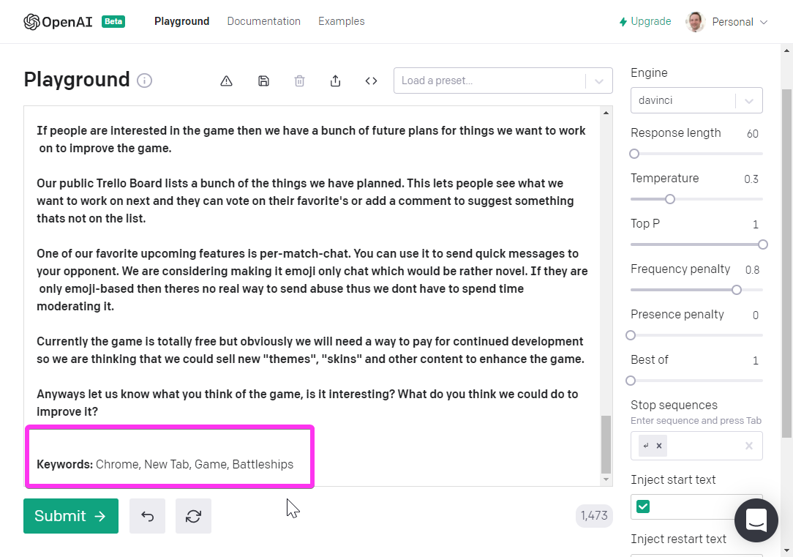
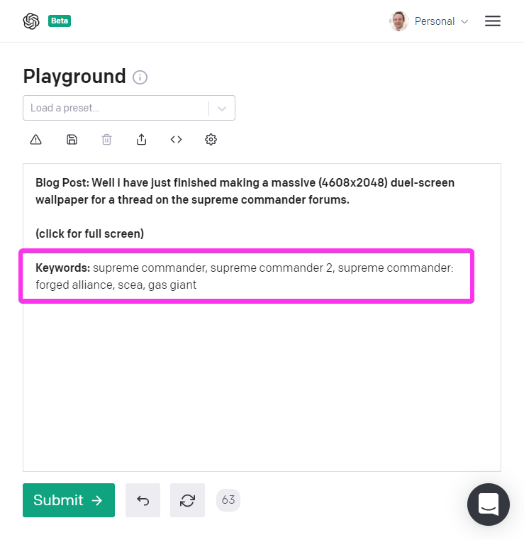

Back in in the before-times of May 2020 OpenAI made a [stunning announcement](https://openai.com/blog/tags/announcements/) about the capabilities of their latest project named GPT3. When I saw [what it was capable of](https://beta.openai.com/) and it was going to be turned into an API I knew I was going to have to tinker with it!

<!-- more -->

# TL;DR

I tried out the worlds most advanced Natural Language Processing AI Model on a real world problem and received mixed results.

# GPT3

Generative Pre-trained Transformer 3 (GPT-3) GPT3 is a MASSIVE (175 billion parameter) Natural Langue model that was trained on basically the entire internet. This means that given any chunk of text its able to comprehend it and generate a realistic output.

Seriously, if you haven't seen some of the things this AI can do stop reading this now and head over to https://beta.openai.com/examples and check them out, its pretty mind blowing.

[](./examples1.png)

The power and possibilities of this tech are endless..

.. that is if it works as well as the examples indicate _portentous music plays_.

Eager to try it out for myself, I signed up for the closed beta on the spot.

# Many Months Later

I finally received my invite to try it out. My first step was to play with some of the examples in their playground.

<iframe width="853" height="480" src="https://www.youtube.com/embed/iumG64XEBik" frameborder="0" allow="autoplay; encrypted-media" allowfullscreen></iframe>

So far so good, looks awesome!

Then I decided to set it a little challenge. One of the examples is called "TL;DR summarization":

> This prompt summarizes text by adding a 'tl;dr:' to the end of a text passage. It shows that the API understands how to perform a number of tasks with no instructions.

So given this post from my blog: [Introducing BattleTabs](https://mikecann.co.uk/posts/introducing-battletabs), I wonder what kind of tl;dr it will give me..

[](./tldr1.png)

Ah that doesn't look right. Perhaps its struggling because I gave it Markdown rather than raw text?

I decided to remove all the Markdown markup and run it again..

[](./tldr2.png)

Awesome! It now works and gives me a really nice summary :)

# Whats Next?

I wondered what real-world problem I could give it that would be simple but interesting enough to test its capabilities a little more.

I played with the examples a bit more while I pondered.

[One caught my eye](https://beta.openai.com/examples/default-keywords):

> Extract keywords from a block of text. At a lower temperature it picks keywords from the text. At a higher temperature it will generate related keywords which can be helpful for creating search indexes.

Well, this blog has over 600 posts on it and many of those posts are old and are missing Tags. Could I run all my tagless posts through GPT-3 and use this keyword extractor to generate the tags, I wondered.

It might be worth a shot, it would save me a bunch of time manually going through them and improve the navigability of this blog in the process.

First step was to try out this keyword extractor with my manually-markdown-stripped text from before.

As "[Introducing BattleTabs](https://mikecann.co.uk/posts/introducing-battletabs)" is a fairly recent post it already has some manually hand-crafted tags:

```
- chrome extension
- game
- async
- typescript
- battleships
```

Lets see what GPT-3 comes up with:

[](./keywords1.png)

Wow! Impressive, sure its not quite as good as my manually crafted tags but still it worked really well.

Confident with my little experiment I set to work writing a script that would run through all my tagless posts strip out the text from the markdown and call the OpenAI API to get the keywords.

Simples! ...

It turns out that stripping the markdown markup from text is actually more complex that I thought it would be. To cut a long story short I decided to render the Markdown to HTML then using Puppeteer I extract the text from the page using `element.textContent`.

I will spare you all the other steps but if you are interested you can checkout the final script [HERE](https://github.com/mikecann/mikecann.co.uk/blob/master/scripts/openAIKeywords.ts).

# Results

I ran the script and 623 seconds later it had run through the 213 tag-less posts from a total of 612 posts.

_If you are interested, I have uploaded all the results [HERE](https://gist.github.com/mikecann/6efd37e58c5b0a38e0182bf40ac6a71e)._

It was able to generate tags for 177 of those 213 posts leaving 39 left over that it couldnt find keywords for. This isnt too bad, I was expecting a bunch of the older posts to be too short or to reference the visual (image or video) content too much to be able to extract any meaningful keywords from the text.

But what about the ones it could find keywords for?

Well firstly the good news, it seems like it was able to find good keywords for some of them. For example [my post titled "Village Life" from back in 2012](https://mikecann.co.uk/posts/village-life) it was able to generate these tags:

```
"mobile",
"game",
"facebook",
"multiplayer",
"flash",
"social",
"facebook",
"multiplayer",
"flash",
"social",
"facebook",
"multiplayer",
"flash",
"social",
"facebook",
"multiplayer",
"flash",
"social",
"facebook",
"multiplayer",
"flash",
"social",
"facebook",
"multiplayer,"
```

If you take the first 6 tags `mobile, game, facebook, multiplayer, flash` which is pretty impressive given the entire of the blog post text is:

```
Village life is a flash-based social game I worked on while at Playdemic. Its incredibly popular and has been played by millions of people.

I was responsible for the underlying client side technology that was used for developing the game.

Play it on facebook: https://apps.facebook.com/villagelifegame
```

Notice that nowhere in the post do I mention the word "multiplayer" or "social" but somehow it was able recognize that the game is that its "multiplayer" and "social" too.

I suspect it knows this from the various news stories about that game around the web that it gobbled up during its training. This would also explain the "mobile" tag and segway us into the negatives results of this experiment.

The problem with the "mobile" tag is that even tho the game was eventually ported to mobile I wasn't involved with the port and at the time the blog post was written the port didn't exist for mobile.

So this is a bit of a problem if I want to use these automatically generated tags for my posts as im now labelling my posts with falsehoods.

The issues continue. You many have noticed that the tags it generated are repeated many times. Well this seems to occur more often than not e.g.

```
 {
    "title": "Started Work at TheBroth in Perth!",
    "prompt": "Blog Post: Just a quick update. After a year of living down in Bunbury Western Australia and working Freelance and on my own projects (see this blog for more) I have decided to re-enter the workforce. Mainly because I was going a little stir crazy being by myself most of the day every day.\n\n\nI have taken a job 2 hours north in Perth at a company called TheBroth. We mainly work on a mobile and web game called SlotsGalaxy. Its similar sort of work to which I was doing at Playdemic so hopefully my old skills arent too rusty :)\nIm going to continue to work on my projects such as Mr Nibbles Forever and Post To Tumblr and my (still) unreleased strategy game but obviously time is going to be a little more limited.\nI have enjoyed the past year mostly but I think it was time for a change and im looking forward to the next year!\n\nKeywords: ",
    "tags": [
      "games",
      "game design",
      "game development blog",
      "game design blog",
      "games blog",
      "game development blog",
      "game design blog",
      "games blog",
      "game development blog",
      "game design blog",
      "games blog",
      "game development blog",
      "game design blog",
      "games"
    ]
  }
```

or worse it just gives up and starts repeating the same keyword:

```
{
    "title": "Supreme Commander Wallpaper",
    "prompt": "Blog Post: Well i have just finished making a massive (4608x2048) duel-screen wallpaper for a thread on the supreme commander forums.\n(click for full screen)\n\nKeywords: ",
    "tags": [
      "for alliance",
      "for allianc",
      "for allianc",
      "for alliance",
      "for allianc",
      "for allianc",
      "for allianc",
      "for allianc",
      "for"
    ]
  },
```

This could obviously be mitigated by removing duplicates but its worrying as the even the de-duplicated tags arent really that useful.

For example for the above Supreme Commander post the de-duplicated tags would be: `for alliance, for allianc, for` which doesnt actually say anything about the post.

# Whats Going On?

Why does the result of that original experiment on the "Introducing BattleTabs" post come out so good but when I run my script many of the results come out garbage?

I decided to run a quick text, take the Supreme Commander post and manually put it into the OpenAI Playground and see what I get:

[](./supcom1.png)

Well thats not perfect, I would expect it to mention something about wallpaper or perhaps creation, Photoshop or something but at least its not repeating and seems to be more relevant to the game.

# Conclusion

Unfortunately I have run out of time to tinker on this little side-quest at the moment.

My conclusion is that although very impressive, the purpose I used the model for is not quite what I was looking for so in the end I decided not to use the generated tags.

Im 100% sure that this is the future tho. I mentioned [back in 2017](https://mikecann.co.uk/posts/a-game-developer-learns-machine-learning-intent) that:

> I see a future where an AI is capable of generating an entire game based on your preferences such as "I would like a game that plays like Mario but has the same size and scope as World of Warcraft", the AI then generates variants on that for you to play.

GPT-3 is definitely leading the way towards that being a possibility. If you dont believe me checkout [this tweet](https://twitter.com/sharifshameem/status/1282676454690451457?s=20) of someone using GPT-3 to generate HTML from some natural language.

So, although for my example I don't think its quite there, I can definitely see this becoming more and more a part of our lives.

I see programming changing drastically over the coming years, going from less of telling the computer how to do something and more having a conversation with the computer and asking it to iterate on what it generated. If you want a glimpse at what this awesome future may be like then checkout the incredible [GitHub Copilot](https://copilot.github.com/).

P.S. The generated keywords for this post are: `AI, NLP, NLU, Natural Language Understanding, Machine Learning` :)
