As is [rapidly becoming a trend](https://mikecann.co.uk/posts/tinkering-with-spacetime-db) in my tinkering adventures, today's post chronicles a bit of a failed adventure. But that's okay, it's always good to explore and learn, particularly in the rapidly evolving field of AI.

# LazyAI

There are a lot of these text-to-app startups around at the moment. One of the most famous is [Devin from Cognition.ai](https://www.cognition.ai/introducing-devin). That one is not available yet, but I wanted to explore another one that has been getting some buzz lately: [Lazy.ai](https://www.getlazy.ai/).

[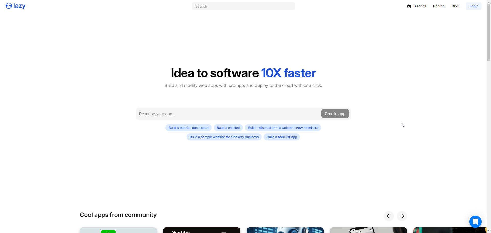](./tagline.png)

Its tagline is "Idea to software 10X faster." Let's see how it does.

# The Project

As I am [a massive Convex.dev fan](https://mikecann.co.uk/posts/im-now-a-convex-developer-advocate), I knew it had to be something Convex related. I felt like this could be tough for the AI, as Convex is not as well-known yet, and so the LLM may not have as much pre-trained knowledge.

Something I had wanted to experiment with for a while was some sort of visualization for Convex database schemas so you can see the relationship between tables and types. I was imagining some sort of class diagram:

[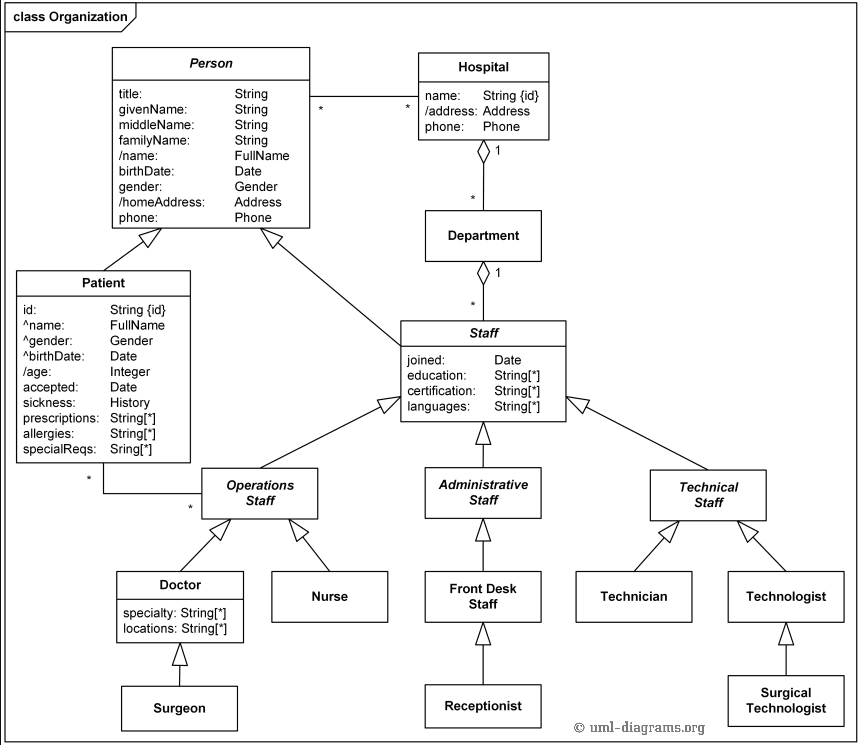](./classdiagram.png)

Or even better, a program that can generate the diagram dynamically such as [TSDiagram](https://tsdiagram.com/).

[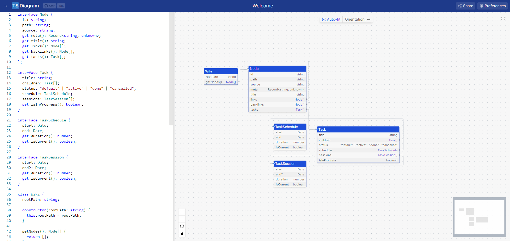](./tsdiagram.png)

# LazyAI Conversation

So, with that, I entered the following prompt into LazyAI:

> I would like to build an app that takes in a convex database schema and generates a Directed Acyclic Graph of the relationships between the tables and types.

It came back with a helpful plan of attack.

[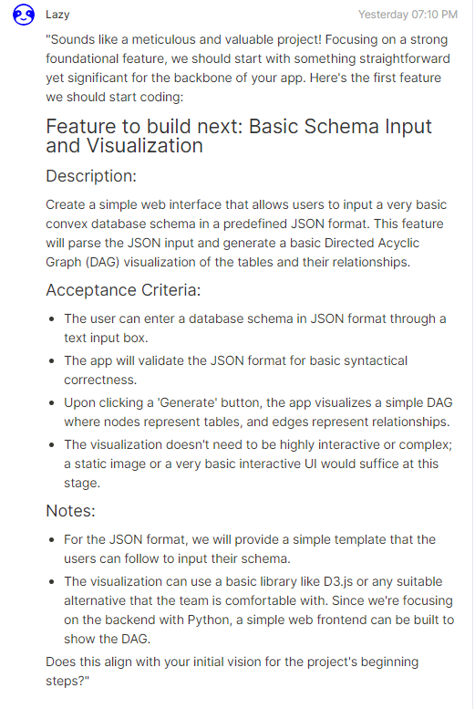](./lazy1.png)

I felt like maybe I was being a bit tough on it, so I gave it a bit more info:

> My project is TypeScript based. I want to be able to run this tool as a TypeScript script and have it analyze the convex.dev database schema that I give it. For example:

```ts
const schema = defineSchema({
  messages: defineTable({
    authorId: v.id("users"),
    body: v.string(),
    likes: v.int64(),
    replies: v.int64(),
    isReplyToMessageId: v.optional(v.id("messages")),
    imageId: v.optional(v.string()),
  }).searchIndex("search_by_body", {
    searchField: "body",
    filterFields: ["authorId"],
  }),

  users: defineTable({
    handle: v.string(),
    name: v.string(),
    pictureUrl: v.union(v.string(), v.null()),
    tokenIdentifier: v.string(),
  })
    .index("by_token", ["tokenIdentifier"])
    .index("by_handle", ["handle"]),

  lists: defineTable(
    v.union(
      v.object({
        kind: v.literal("all_messages"),
        ownerId: v.id("users"),
        name: v.string(),
      }),
      v.object({
        kind: v.literal("search"),
        ownerId: v.id("users"),
        name: v.string(),
        query: v.string(),
        includeReplies: v.boolean(),
      })
    )
  ).index("by_ownerId", ["ownerId"]),

  likes: defineTable({
    likerId: v.id("users"),
    messageId: v.id("messages"),
  })
    .index("by_likerId", ["likerId"])
    .index("by_messageId", ["messageId"])
    .index("by_messageId_likerId", ["messageId", "likerId"]),
});
```

The response it came back with was:

[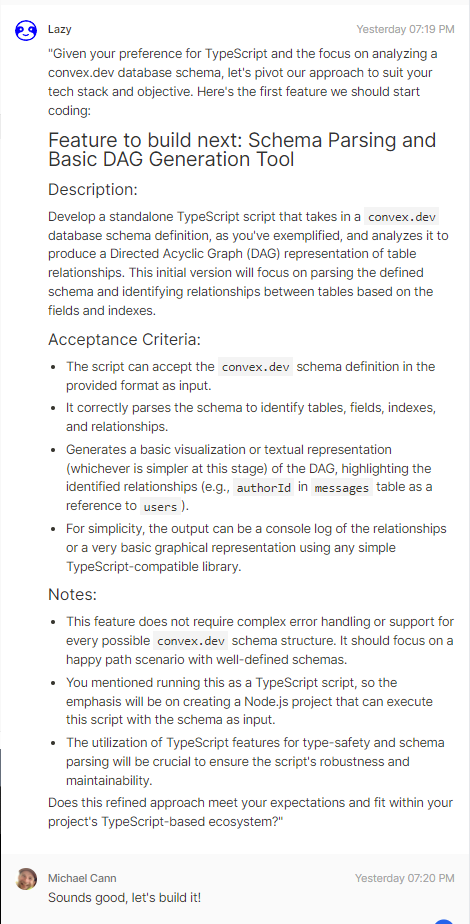](./lazy2.png)

I felt like that was actually a reasonable plan and told it to go ahead.

Now, the way the app works is that it's split into three parts: Test, Code, and Env Secrets.

[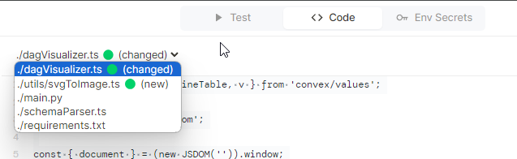](./lazyparts.png)

So in theory, I should be able to test the output it generates. Well, this is where things unfortunately start to go off the rails a bit because to test (even your first project), you need to sign up for a pro membership.

[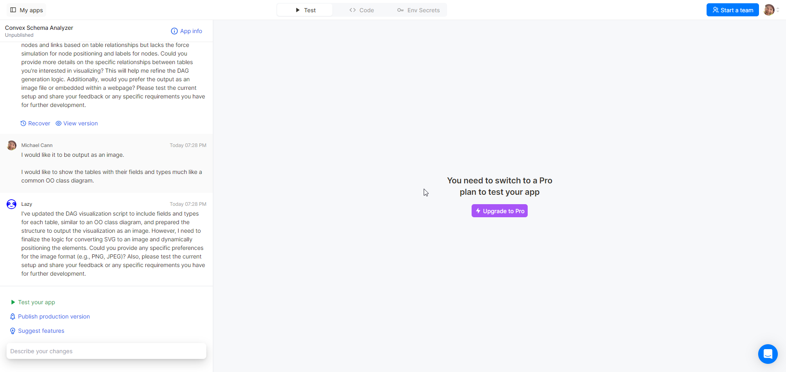](./lazypro.png)

Which I would have been happy to do if I felt like the tool was going to give me some value, but the pricing scared me off.

[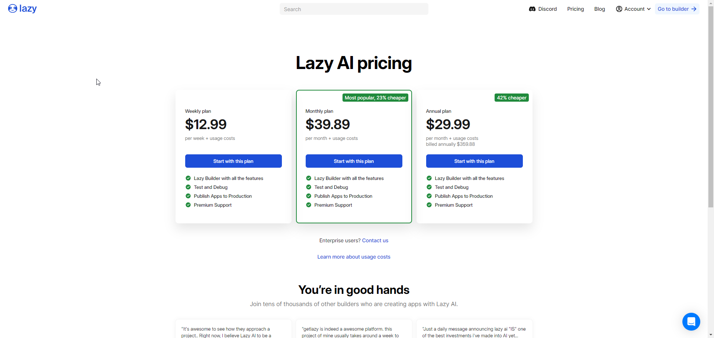](./lazypricing.png)

$39.89 per month just to see if the code works and then usage costs on top of that?! No chance I was going to pay that just to check it out.

So after a little bit more back and forth with the AI, I decided to take a look at the code and copy it into VSCode to see if I could get it to run myself.

Well, unfortunately, I was to be disappointed again.

[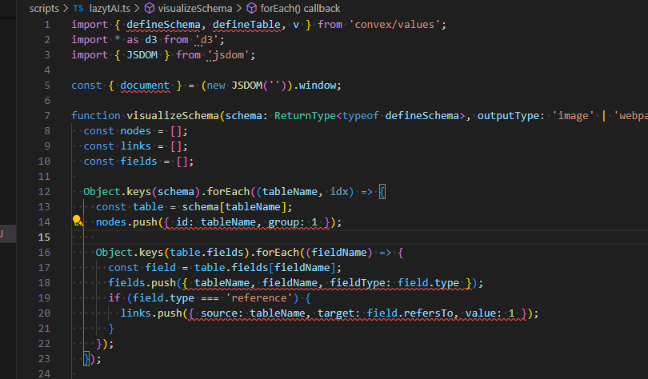](./lazyerrors.png)

There was no chance this code would compile or even run. There are TypeScript type errors all over the place and the imports wouldn't work from the wrong packages, etc.

I tried to give it the benefit of the doubt though and fixed the compile errors and import errors and tried to run it. Sure enough, no dice.

[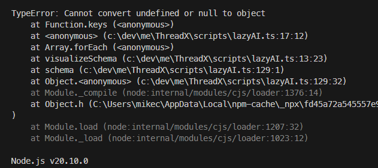](./lazyrunerror.png)

# LazyAI Conclusion

It's not ready yet. I think the task I gave it was quite tricky and maybe I was asking too much, but I think I was willing to give it the benefit of the doubt until I saw the pricing for it. Then my sympathy evaporated.

Fortunately, there are a lot of these "AI Project Generation" projects out there and as I still had a bit of time left to tinker, I thought I would give another one a go.

# Pythagora.ai

https://www.pythagora.ai/

[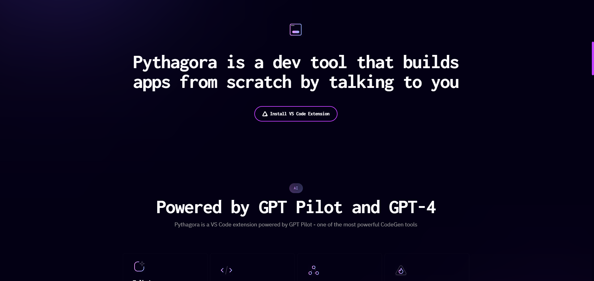](./pythagora.png)

This one touts itself as a "dev tool that builds apps from scratch by talking to you." Sounds great, let's give it a shot.

This one works a little differently. It is a VSCode extension that you need to install [from the store](https://marketplace.visualstudio.com/items?itemName=PythagoraTechnologies.gpt-pilot-vs-code&ssr=false#review-details). So I headed over there and immediately was discouraged to see that it was only 3 stars out of 5. I was not off to a good start.

[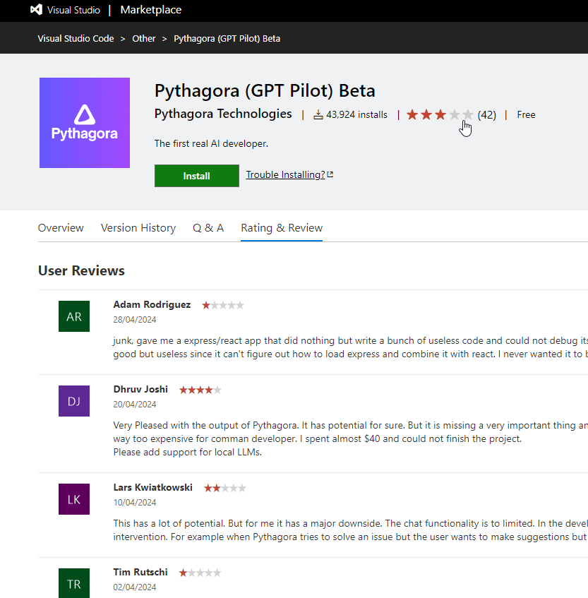](./pyreviews.png)

After a bit of a confusing setup (you have to first install another tool, gpt-pilot apparently) I had it working.

[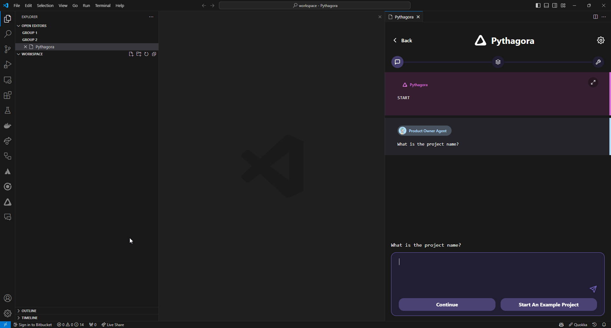](./pyworking.png)

(just a side note, having an AI running on my local system from an unknown developer with full access makes me kind of nervous.)

This time I was a little more generous with the initial prompt:

> I would like to build a Node.js TypeScript app that takes in a convex.dev database schema and generates a graph of the relationships between the tables and types.
>
> I want to be able to run this tool as a TypeScript script inside of my convex project and have it analyze the convex.dev database schema that I give it.
>
> I want the output to be an image that looks like something like a class diagram from classic UML.
>
> This is an example convex schema:

```ts
const schema = defineSchema({
  messages: defineTable({
    authorId: v.id("users"),
    body: v.string(),
    likes: v.int64(),
    replies: v.int64(),
    isReplyToMessageId: v.optional(v.id("messages")),
    imageId: v.optional(v.string()),
  }).searchIndex("search_by_body", {
    searchField: "body",
    filterFields: ["authorId"],
  }),

  users: defineTable({
    handle: v.string(),
    name: v.string(),
    pictureUrl: v.union(v.string(), v.null()),
    tokenIdentifier: v.string(),
  })
    .index("by_token", ["tokenIdentifier"])
    .index("by_handle", ["handle"]),

  lists: defineTable(
    v.union(
      v.object({
        kind: v.literal("all_messages"),
        ownerId: v.id("users"),
        name: v.string(),
      }),
      v.object({
        kind: v.literal("search"),
        ownerId: v.id("users"),
        name: v.string(),
        query: v.string(),
        includeReplies: v.boolean(),
      })
    )
  ).index("by_ownerId", ["ownerId"]),

  likes: defineTable({
    likerId: v.id("users"),
    messageId: v.id("messages"),
  })
    .index("by_likerId", ["likerId"])
    .index("by_messageId", ["messageId"])
    .index("by_messageId_likerId", ["messageId", "likerId"]),
});
```

Then followed a plan that the AI came up with and interestingly, it asks me before it runs commands:

[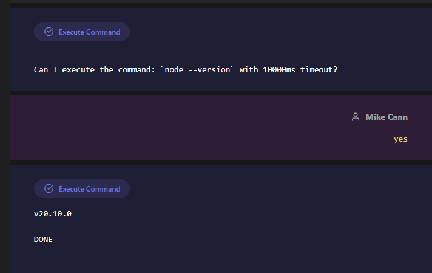](./pycommands.png)

Ughh, it seems like it gets stuck quite easily though when something isn't installed that it needs:

[

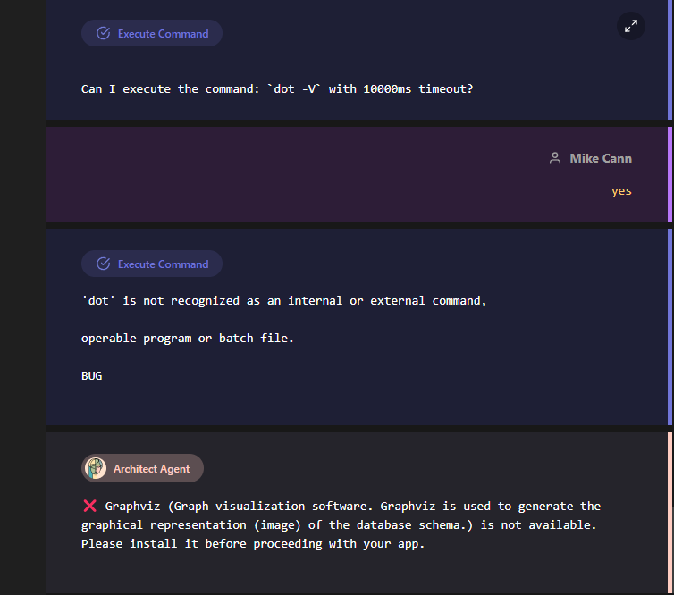](./pydot.png)

I didn't want to install anything else right now, so I just clicked past it.

It seemed to continue just fine, then began installing a bunch of Node packages and setting up a TypeScript project for me, which was kind of nice.

It stops every now and then to check with you to make sure everything is looking good, which is nice.

[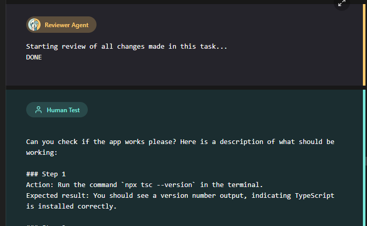](./pyreview.png)

It started to generate some TypeScript. It looked like there were some errors, but I was starting to feel confident that it might be able to debug its way out of it. Then I hit:

[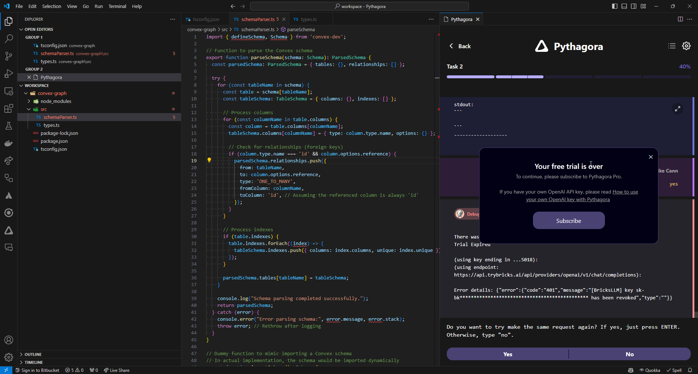](./pyfreetrialover.png)

Fortunately, their pricing is much more reasonable than LazyAI and even lets you use your own OpenAI keys!

[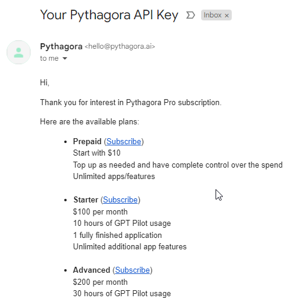](./pyapikey.png)

I was keen to see where this went, so I decided to spend $10 (and tip the developer) to find out.

I put together this little video to give you a sense of what the process feels like:

<iframe width="853" height="480" src="https://www.youtube.com/embed/YmhPVFl-dVE" frameborder="0" allow="autoplay; encrypted-media" allowfullscreen></iframe>

Unfortunately, as can be seen from the video, the code is very broken and would not run even if I followed the instructions they gave me.

# Conclusion

Unfortunately, I had now run out of time to tinker with this any more, but I felt like it was possible that I could have gotten to something usable with Pythagora, which I didn't think was likely with LazyAI.

Could I build a graph visualization faster myself? Probably, but that's not the point. The point is that I can potentially hand this task off to my "junior developer" and have them work on it for me while I do something else, like touching grass for example (ewww).

So my takeaway is that it's not ready yet, at least these two aren't ready.

LazyAI has a long way to go, but I think I do prefer the running code in an online sandbox process over Pythagora's run the code on your local system approach, which quite frankly makes me nervous.

Running in a sandbox also means that the AI doesn't have to continually pause to ask me if it's okay to run a command (like Pythagora does), as it can simply run it without fear of damaging the underlying operating system.

I am looking forward to future versions of App Generators. In particular, [Devin](https://www.cognition.ai/introducing-devin) looks very promising and also runs in a sandbox-like environment. I added myself to their waitlist, so stay tuned. I may well revisit this in a future blog post!
