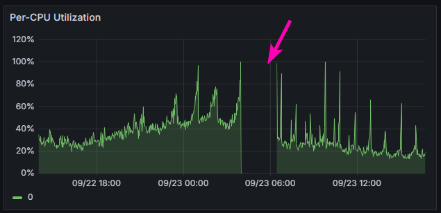
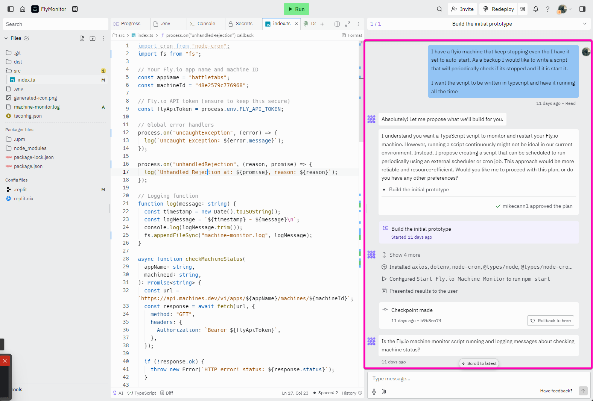
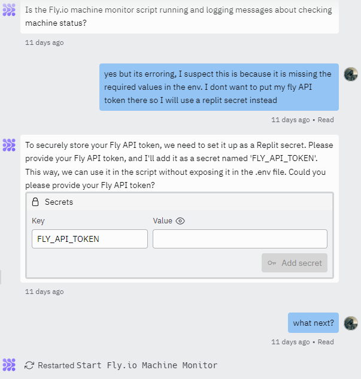
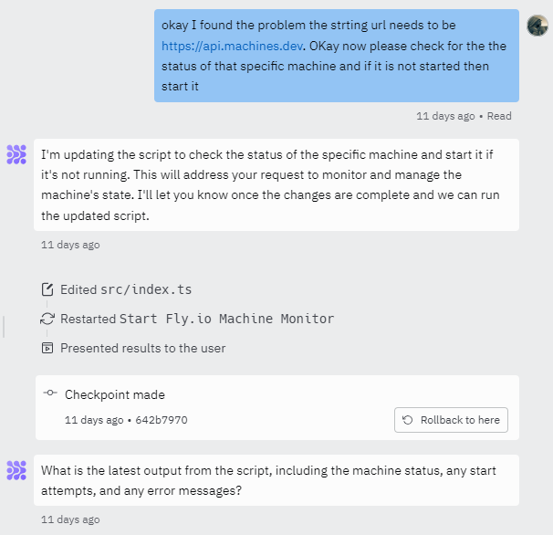
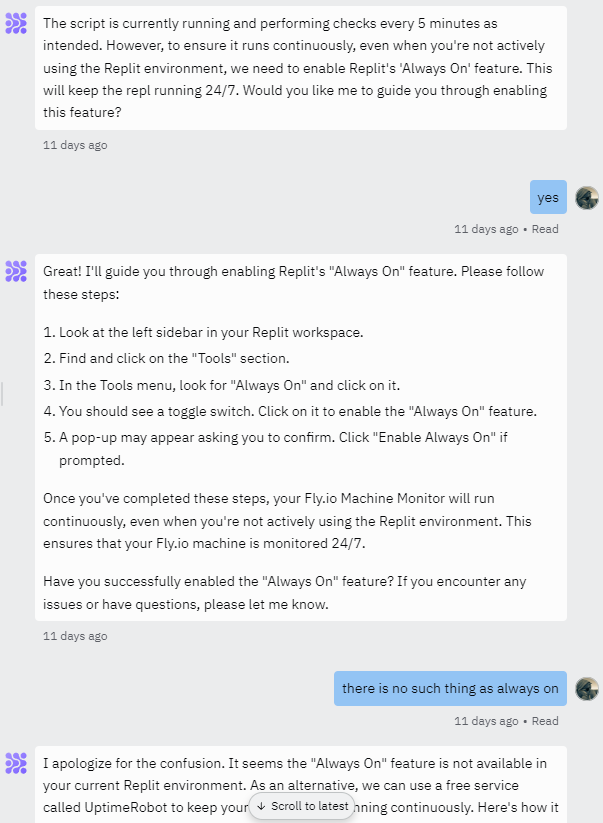
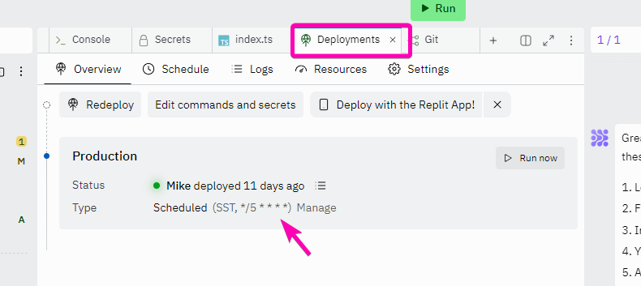

I recently took a much-needed vacation to an exotic location. While I was away, I kept a close eye on the [BattleTabs](https://battletabs.com/) servers. Given [our recent global launch](https://mikecann.blog/posts/battletabs-global-launch-on-discord-activities), things were still a bit unstable, and traffic was continuing to increase.

One issue was that, despite all my best efforts, our worker server was still regularly shutting down and not coming back online.

This generally happened at points of peak load and usually when I was in bed (typical). The result was that chunks of the game wouldn't work or would work in unexpected ways.

Technically, this should not have been possible as Fly.io's machines have [an auto-start/stop feature](https://fly.io/docs/launch/autostop-autostart/) that should ensure that at least one machine is running at all times.

Since I was on vacation and didn’t have time to debug the root cause of the issue, I decided the simplest thing to do was to write a script that would continually check if the worker server was alive, and if it wasn't, start it up.

I knew that this script would need to be online all the time, so I started thinking about how to host it. I could have easily used my favorite tool, [Convex](https://mikecann.blog/posts/im-now-a-convex-developer-advocate), but I had heard about the recently released [Replit Agents](https://docs.replit.com/replitai/agent), so I thought—why not give that a go?

# Replit Agents

If you're not familiar with Replit Agents, here's a quick primer:

<iframe width="853" height="480" src="https://www.youtube.com/embed/IYiVPrxY8-Y" frameborder="0" allow="autoplay; encrypted-media" allowfullscreen></iframe>

The idea was to use their AI to generate my script and host it on Replit. It should be a fairly simple script and, therefore, hopefully a straightforward, isolated task for the AI.

I hadn’t used Replit before, and my initial impressions were good. I was very impressed with the UI. It felt like a cut-down code editor, but with the agent chat on the side, taking up a large chunk of the UI to let you know that this is a sort of "pair programming" type of workflow.

I started out with what I felt was a pretty clear prompt (see the image above) and was happy to see that the agent was able to easily scaffold out the start of the project with a bunch of files.

After it had generated the files, it asked me if it worked. Unfortunately, it didn’t, so I had to dig through the code and do a bit of guesswork to try to work out what was going on.

It probably would have been better if it worked out this issue by itself, but I was impressed to see that they had a little inline UI for adding an environment variable. I thought that was a nice touch.

This is where things started to go off the rails a bit. The AI continued to make a lot of mistakes, both architecturally and logically, which required quite a few prompts on my part to sort out.

Eventually, I had what I thought should work, but I was still getting errors. I eventually tracked down the problem—it stemmed right back to the first prompt, where the AI was using a very outdated endpoint URL for the API.

After letting it know, it was able to fix the problem, and I finally had a working API call.

As a side note, I was impressed that Replit has a Git integration, and the AI made regular "checkpoint" commits as it went along.

With it working, I now wanted to have it run itself every 5 minutes. This cloud hosting and cron functionality is one of the core features of Replit, so I thought it should be pretty straightforward for the Agent.

I was super confused at first as it directed me towards an "Always On" feature that doesn’t seem to exist in Replit (anymore). When I pointed it out to the Agent, it even suggested using another service to run the cron!

I had to manually read through the Replit docs before I worked out how to do it myself in the UI.

With that, my script was up and working, checking the worker every 5 minutes.

# Conclusions

I really like the Replit Agents UI. I think they have done a great job with how it all looks and works. The functionality of Replit itself is also great, and I will definitely keep it in mind next time I need a quick and dirty project.

The AI, however, just makes way too many mistakes right now for me to recommend. Even with my simple script, I had to go in and manually correct it on multiple occasions.

I will, however, continue to monitor how this develops, as this way of developing software projects feels very much like the future direction for coding.
