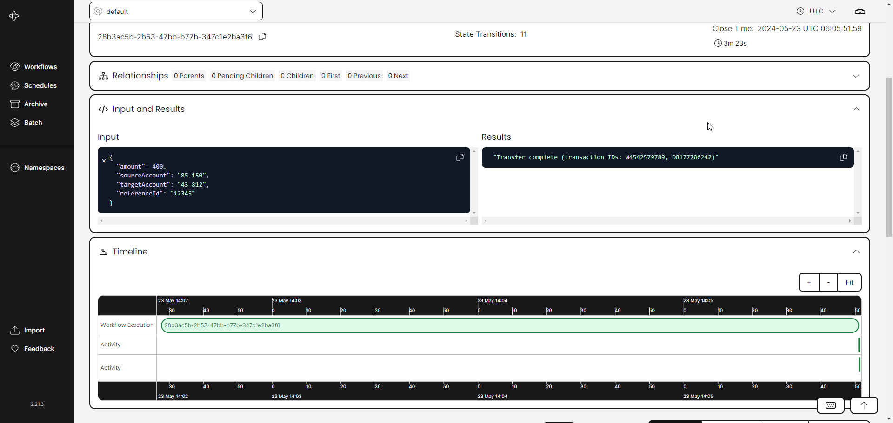
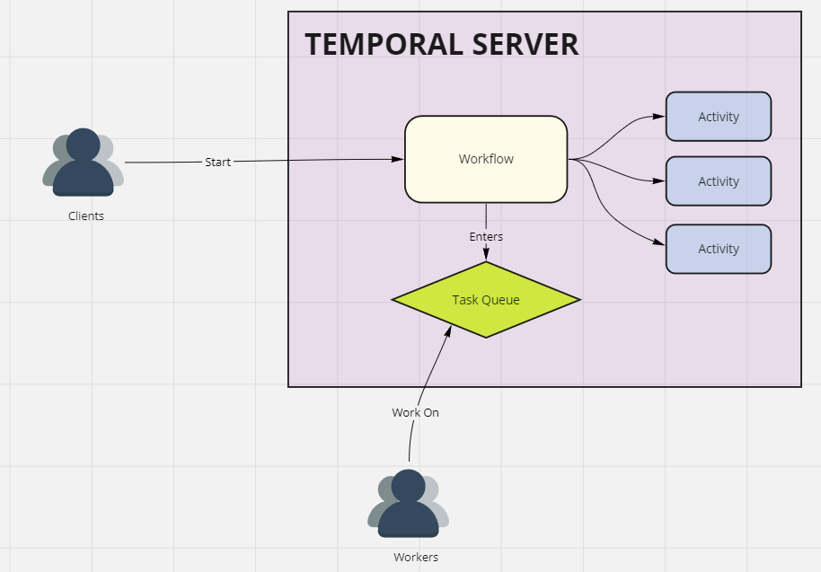
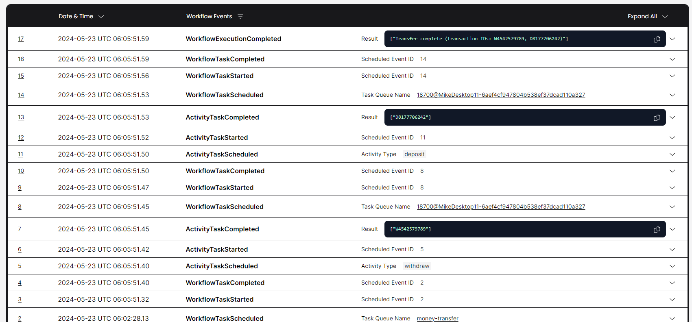
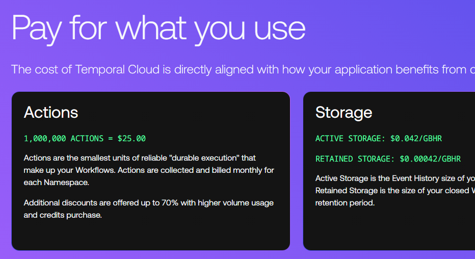

I've been meaning to tinker with Temporal for quite some time now, as it intersects some of my key interests: [Event Sourcing](https://mikecann.blog/posts/serverless-databaseless-event-sourcing), [durable execution](https://mikecann.blog/posts/tech-to-tinker-with-in-2022), and [cool application architectures](https://mikecann.blog/posts/tinkering-with-convex).

# What is Temporal?

From their [website](https://temporal.io/):

> Durable Execution is a development abstraction that preserves complete application state so that upon host or software failure, it can seamlessly migrate execution to another machine.

But what does that mean exactly?

From a coder's perspective, it means you can define "Workflows" in TypeScript such as:

```ts
export async function SubscriptionWorkflow(email: string, trialPeriod: string | number) {
  await sendWelcomeEmailToUser(email);
  await sleep(trialPeriod);
  await sendSubscriptionEndedEmailToUser(email);
}
```

Temporal ensures this function continues to exist even if the server that runs it shuts down. When the server starts up again, it can resume from the correct location, making it "durable." Temporal also handles errors and retries the steps in the Workflow if they fail.

If this doesn't immediately seem impressive, consider how difficult it is to resume a function's execution at any arbitrary point after the fact, especially when dealing with non-deterministic states like DateTimes and random numbers.

# Exploring Temporal

My goal with any "tinkering" I do is to understand the technology enough to form an opinion about it.

I started with [the docs](https://docs.temporal.io/), which are quite thorough. Setting up the environment included installing the Temporal CLI and running their local service, which even comes with a nice WebUI to display your Workflows:

[](./webui.png)

After reading through the initial pages of the docs, I summarized the key structure and terms with this diagram:

[](./diagram.png)

Clients start Workflows, which can contain several Activities. Workflows enter a Task Queue from which Workers pull and execute tasks. If activities fail, they can be retried an infinite (configurable) number of times.

Every "[Action](https://docs.temporal.io/cloud/pricing#action)" the system takes (starting a workflow, running an activity, signals, queries, etc.) is an event recorded within the system, which is then recorded against your workflow so you can view exactly what happened and when:

[](./events.png)

## Event Sourcing

It's worth taking a tangent to discuss another application architecture dear to my heart: [Event Sourcing](https://martinfowler.com/eaaDev/EventSourcing.html).

I won't explain all of Event Sourcing here, as I've covered it before on this blog and there are many good deep-dives available online. The basic idea is that your entire application should be described with immutable events. To get the current state of your application, you fold/reduce your events down to a state. For example, you might have a "UserCreated" event with the user's name "Dave." Later, if Dave changes his name to "Davina," the system triggers a "UserChangedName" event.

Because we record all the events in order and each event is immutable, we can always reconstruct the current state of the user at a later date and see exactly what led to that state. This state reconstruction is called "Projection" in Event Sourcing terminology and is fundamental to Event Sourcing.

Now, suppose you want to model a "Process" like the Temporal Workflow example at the start of this post.

1. A user clicking a button creates a "UserTrialSubscriptionStartRequested" event.
2. A "Process Manager" picks up that event, sends the user an email, and emits a "UserTrialSubscriptionStarted" event.
3. It could also set up a timer so that after the trial period ends, a "UserTrialPeriodEnded" event is fired.
4. The Process Manager detects that event, sends the user another email to let them know their trial has ended, and emits a "UserTrialSubscriptionEnded" event.

What I've outlined with "Process Managers" is exactly what a Temporal "Workflow" does but with a nicer developer experience. Temporal uses clever build-time tooling to ensure that Activities within a Workflow are the entry points when an event occurs. Because side effects are constrained to Activities, we can replay a Workflow to resume a paused state.

# Why?

So why would you want to do this? Many applications (finance, health, military, industry, etc.) need to ensure something happens and have a clear record of exactly what happened to potentially reconstruct events.

Event-based architectures like Event Sourcing and Temporal capture the system as events, then reconstruct the world from those events, rather than the other way around (a typical CRUD system). Temporal.io cleverly combines the best parts of Event Sourcing (the Process Managers) into an entirely standalone product and names it Durable Execution.

# Unanswered Questions

The Temporal docs are extensive, and there's a lot I haven't explored yet.

I've run out of time for this tinkering session, but next time I'd like to build a simple application to see what works and what doesn't. Here are some notes for next time:

- How does input validation on Workflows work? Is there input validation at all?
- Signals and Queries look interesting but a bit convoluted—need to explore those more.
- Should you use Temporal for your entire application state or just Workflow-based state? If not, how do the two combine?

# Pricing

Temporal uses a per-Action-based pricing model:

[](./actionpricing.png)

One million "actions" costs $25. This seems quite expensive since everything results in an action. For comparison, [Convex](https://www.convex.dev/pricing) charges $25 per month for 25 million function calls, and [Cloudflare](https://developers.cloudflare.com/workers/platform/pricing/) charges $0.3 per 1 million function calls.

However, I'd need to make a real app to get a proper sense of how expensive Temporal would be in practice.

# Thinking in Convex

Speaking of Convex, I can't help but think about how I might implement a "Workflow-like" structure on Convex.

I've been considering building an Event-Sourced application on Convex for a while, but I think a simpler structure via State Machines might achieve most of what you want... 🤔

Stay tuned—I may well tinker with this in the future!
