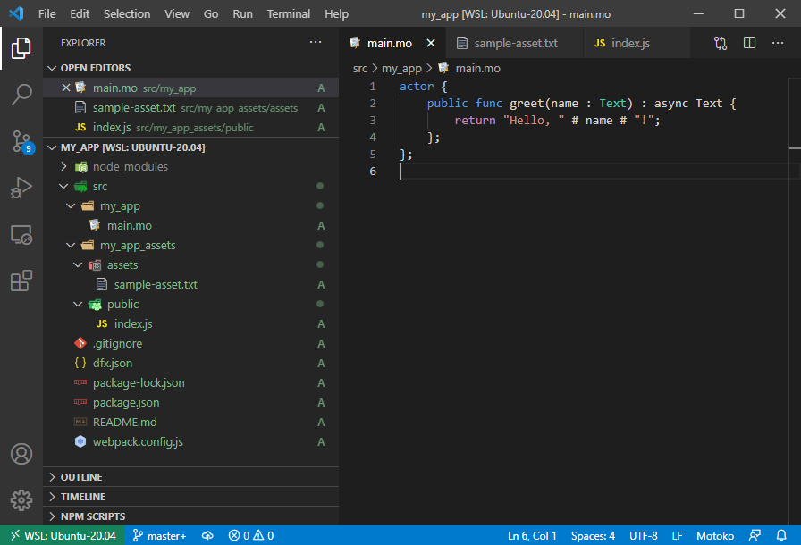

Im not sure how I first came across [Dfinity](dfinity.org) and the Internet Computer project but when I heard about the technologies they were using (Blockchain, Actors, Motoko) and the goals they were striving for I knew I had to have a tinker.

<!-- more -->

# Background

So what is the Internet Computer? Well ill quote [from their website](https://dfinity.org/):

> The Internet Computer is a public blockchain network so powerful that it can natively host hyperscale open internet services, pan-industry platforms, DeFi systems, secure enterprise systems, websites, and all of humanity's software logic and data in smart contracts. It is created by independent data centers worldwide running the Internet Computer Protocol (ICP).

Theres a lot of buzzwords in there but I see it as a decentralized app execution environment much like Heroku or parts of AWS or Azure. Much like those services you dont have to worry about the hardware that runs your code, you just deploy your code and it begins to execute.

[There a bunch of other cool things](https://dfinity.org/faq/) that make the project exciting from the way that the code executes in a "tamperproof" manner to the way the blockchain and tokens are used to both pay for execution and to operate as a governance mechanism.

As a programmer and tech nerd however the main thing that interested me however was their new programming language Motoko and the way the applications are structured in the form of the Actor Model.

So lets start tinkering..

# Getting Setup

Unfortunately the IC's SDK currently only runs on Linux or Mac so to get it to work on Windows I first had to install the Windows Subsystem for Linux 2 which wasn't too bad thanks to [this guide](https://www.omgubuntu.co.uk/how-to-install-wsl2-on-windows-10) but still a little frustrating.

Once setup I was able to install the SDK and create my first project using their command line.

[](./ic-terminal1.png)

I followed their [quick start guide](https://sdk.dfinity.org/docs/quickstart/local-quickstart.html) and soon had my first little application running.

[](./hello-world.png)

As you can see from the image above, your application is split into two parts; the "src/my_app_assets" is the frontend and is your typical Webpack produced Single Page Application and the backend "src/my_app" which is the interesting part in the form of the Motoko actor.

# Actors

Functions you define to run on the Internet Computer run inside something called an Actor. Actors are an [old but fascinating](https://www.brianstorti.com/the-actor-model/#:~:text=The%20actor%20model%20is%20a,this%20model%20is%20probably%20Erlang%20.) concept and are used projects such as [AKKA](https://akka.io/) and [Project Orleans](https://dotnet.github.io/orleans/).

The basic concept is that code and state are located together much like classes in typical OO programming. On the IC actors are written using their special purpose langauge [Motoko](https://sdk.dfinity.org/docs/language-guide/motoko.html), heres an example:

```motoko
actor Counter {

  var value = 0;

  public func inc() : async Nat {
    value += 1;
    return value;
  };
}
```

As you can see you simply define an actor `Counter` which has some state `value` which can be incremented by calling `inc` and then returned to the caller;

Actors dont need to worry about saving their state to a database, the state is automatically persisted and depersisted by the system as actors are invoked.

The beauty of this model is its simplicity. You no longer worry about how to structure your tables and indices in your database simply pass a message to an actor (calling a function) to query or mutate its data.

Calling an actor from the frontend is as simple as importing it and calling it as a RPC:

```js
import my_app from "ic:canisters/my_app";

my_app.greet(window.prompt("Enter your name:")).then((greeting) => {
  window.alert(greeting);
});
```

And because its just an RPC the typescript definitions for your actor are easily generated.

# Queries vs Mutation

The Motoko language has two types of functions you can define in your actor; "query" functions only allow you to read and manipulate data from the actor and "mutation" (my term not theirs) functions that also allow you to update the state of the actor.

The reason why they have two kinds of functions is a bit complicated but has to do with consensus in a decentralized system. When you query data you dont need consensus, the response can simply be retrieved and returned but for a state change (mutation) to happen it must be agreed upon by multiple nodes. This consensus between nodes in the IC takes time and thus there is a delay.

This delay time is actually quite significant, the docs quote [1-2 seconds](https://dfinity.org/faq/), but when running locally its more like 3+ seconds. This might not sound like a lot but when you compare it to the millisecond responses everyone is used to with modern websites it does highlight a bit of an issue.

This inherent mutation delay sounds like a bit of a deal-breaker but if you are careful in the way you apply optimistic state updates on the client, you can make it appear as if the state change happened immediately.

# Other Problems

So there is a lot to be excited about with the IC however I would be remiss if I didn't mention a few issues that I encountered on my tinkering journey.

## No Unit Testing

So far the docs don't mention any sort of automated testing capabilities. I assume that this is something that they will implement at some point but IMO its really important to have this baked in from day one particularly if you are building a Blockchain / DeFi application.

## No Intellisense

Even though there is syntax highlighting and a VSCode plugin there is unfortunately no intellisense or other nice features such as refactoring that im used to from other languages. Again its early days for the project so im sure that will come in time.

## Slow deploy / development iteration process

When you make a change to your Motoko file you must then run `dfx deploy` to build and deploy to your locally running environment. Unfortunately this process currently takes a long time. On my powerful desktop computer it takes 19 seconds each time.

Again im hoping this will be fixed as the project progresses more. I think unit tests could help greatly here too as you can be more confident that your code is going to work before you hit "deploy".

## Not Open Source

This has been a bit of a sore point for members of the blockchain community who are used to cypto projects being open source from the beginning. Dfinity have promised to open source everything at somepoint however.

## Okay-ish docs

I think this is the nature of an early, rapidly developing project but it seems like chunks of the docs are out of date which leads to a bit of confusion. For example some of the tutorials recommend using `dfx deploy` whereas others talk about using multiple deploy steps such as `dfx canister create --all` then `dfx build` then `dfx canister install` etc.

## Not Yet Live

You can currently push code to a "testnet" which will allow you to run your code remotely and have others access it but this is not considered production ready. There are still lots of questions around what happens when the code is in production, who can view the code and data etc.

# Conclusion

I have barely scratched the surface of the Internet Computer but what I have seen I am very impressed with.

I think for my next step I would like to build something a little more meaningful and have it running on a remote network so others can access it.

Right now however im going to keep an eye on the project and wait a while. They have a bit more work to do to make it user friendly and I don't want to pay the early adopter tax when there are so many other cool shiny things to play with ;)
