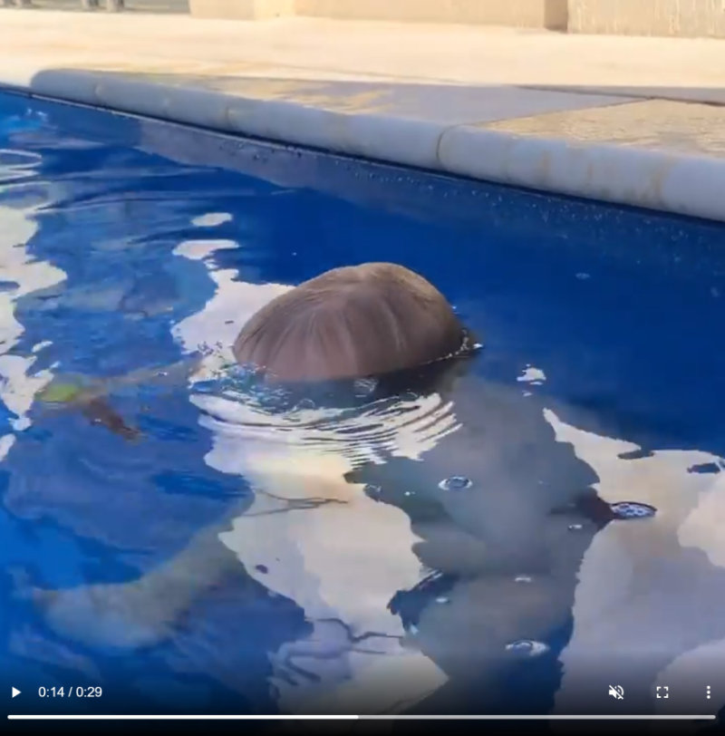

Ever since I was a baby I have loved the water. I remember always enjoying going under the water and holding my breath while I challenged my mates to see who could stay under the longest.

<!-- more -->

That love of the water and exhilaration from underwater adventures has carried through with me into adulthood.

In 2013 during my [trip around South America](https://mikecann.co.uk/posts/the-trip-2013-tyrona-to-bucaramanga) I was fortunate enough to stumble across a poster for the sport / discipline of "Freediving".

I hadn't really encountered it before but I decided to give it a shot and I loved it! I trained for 3 days with [Carlos Correa](https://www.instagram.com/clubdelphinus/?hl=en) who showed me how to safely hit deeper depths and longer holds.

I now regularly enjoy going out whenever I can and often I take my camera and film my exploits. Heres a youtube playlist of my various videos over the years.

# Videos

<iframe width="560" height="315" src="https://www.youtube.com/embed/videoseries?list=PLdFGn0KeUCYer1aL7cEzpcDIg51vycrio" title="YouTube video player" frameborder="0" allow="accelerometer; autoplay; clipboard-write; encrypted-media; gyroscope; picture-in-picture" allowfullscreen></iframe>

# What is so great "under da sea"?

[Darling its better down where its wetter...](https://www.youtube.com/watch?v=GC_mV1IpjWA)

As soon as you take that last breath and dive you are suddenly cut off from the world that we comprise 99.99% of our life. You are now in an alien world and you can snatch a tiny little glimpse of that wondrous place.

Its only you and your own body that keeps you out of danger, it makes you feel very in-tune with yourself. I think thats also the reason why I find the discipline almost meditative, so are focused on you and your movements, your heart-rate and breath. Its all about your experience in your little bubble.

# Joshie

The love of the water and I hope I am able to instil into my son Josh. He is only 19 months old but already he shows a keen affinity to the water. He loves his weekly swimming lesson and daily dips in the pool (during summer).

He has recently started putting his head under the water and holding his breath which is a great this but can be worrying at times!

