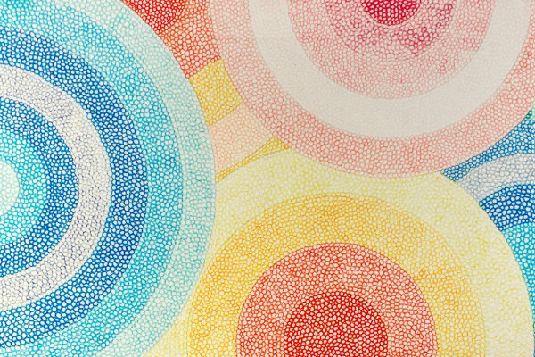
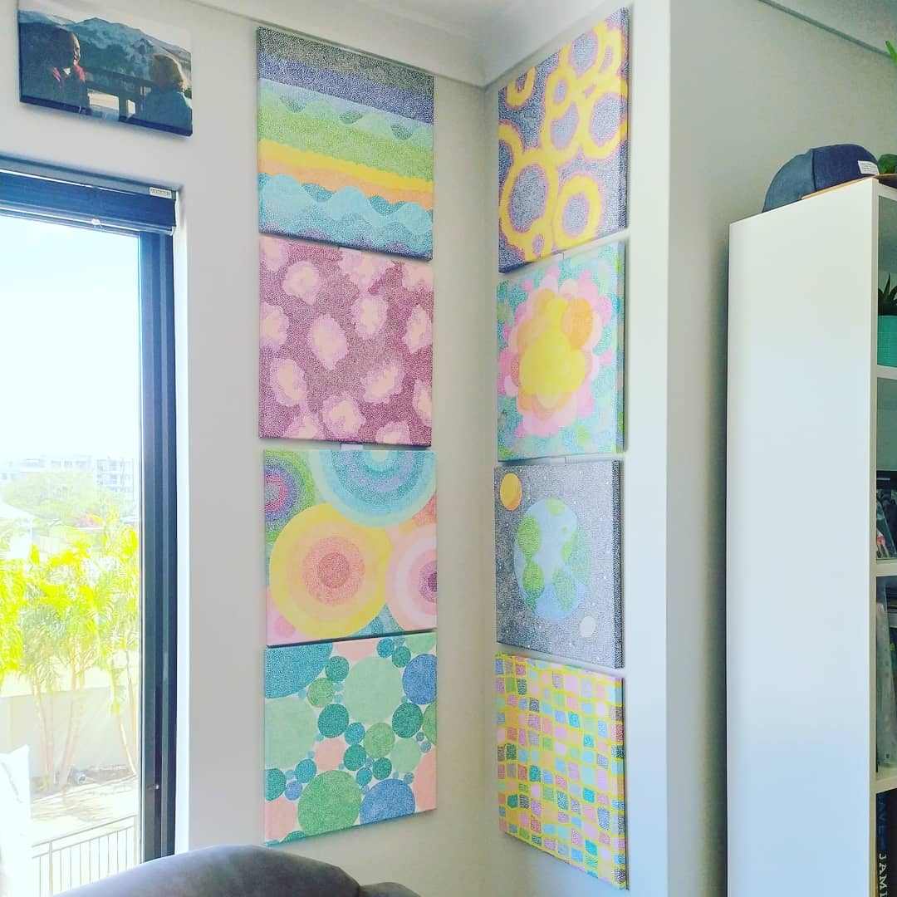
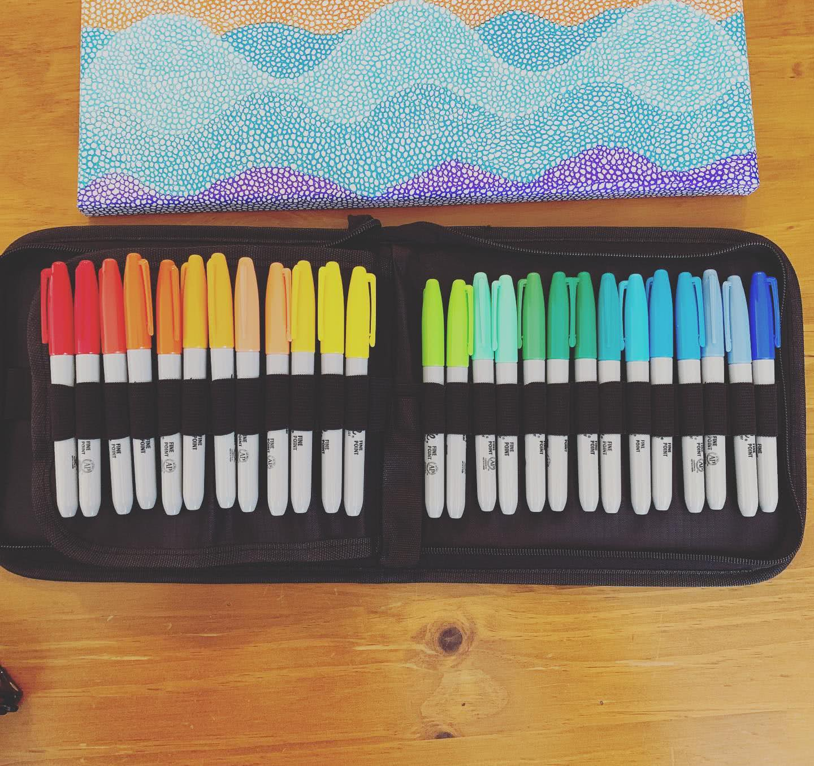
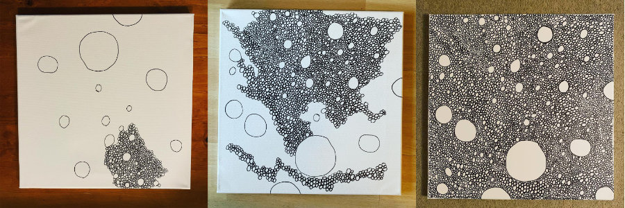
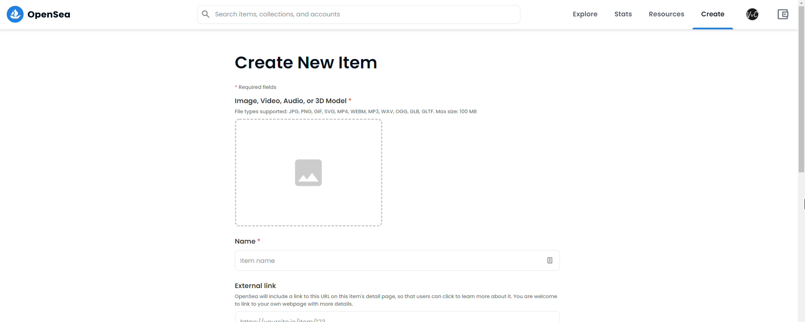
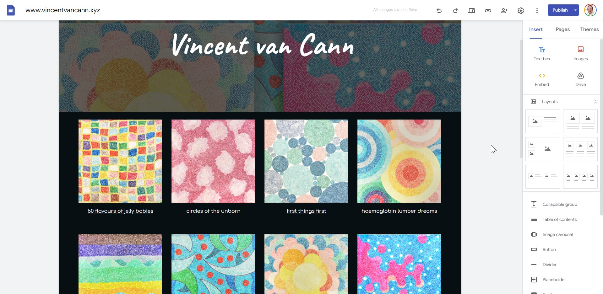
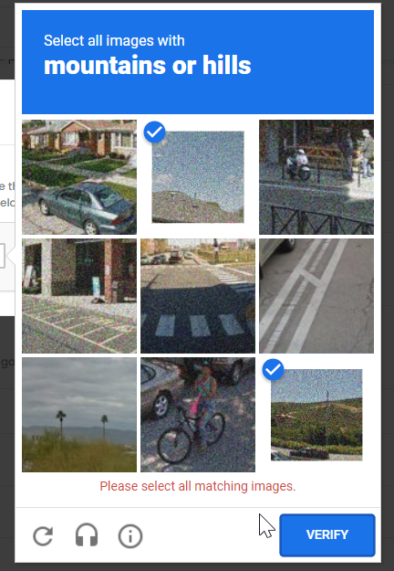
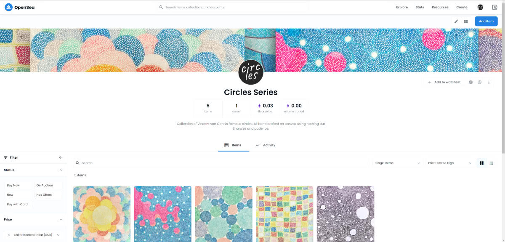

I wanted to experiment more with the NFT space. Get my hands dirty and actually mint an NFT. But what pieces should one immortalize on the immutable blockchain? Then it hit me! Vincent van Cann.

<!-- more -->

# Vincent van Cann

Vincent van Cann is an up and coming artist that has been seen posting under the guise of Michael Cann on Facebook. His is however keen to break out and receive international recognition for his exciting, innovative and perhaps even controversial work.

His style is mostly "circle doodles" in abstract form:

They are painstakingly created over about 8-12 hours using just sharpies:

He finds it very therapeutic and often finds himself entering an almost trance like state while arting. Perhaps his incredible talent is being siphoned into his brain from an artist deity in an alternate dimension?

# NFTs and OpenSea

NTFs have set the art work on fire over the past 12 months so if there was ever a time for an up and coming artist to break out and make a name for himself it was now.

[OpenSea](https://opensea.io/) is currently the largest marketplace for NFTs and there are (as far im aware) two ways to get your NFT listed on there. 1. you create a smart contract, upload the artwork and metadata to IPFS then you link your contract to a collection on OpenSea. Or 2. you mint directly on OpenSea using their mega-contract.

As Vincent van Cann "isn't good with computers and things" he decided to keep it simple and mint directly on OpenSea. Maybe in the future he will get some help from the technical whiz-kid Mike Cann and create his own contract.

Vincent also decided to use Polygon rather than Ethereum as he isnt a wealthy artist and thus dint want to pay the [expensive gas fees found on ethereum](https://crypto.com/defi/dashboard/gas-fees).

As part of the NFT creation process on OpenSea Vincent saw that he could supply a link to his own website.

That got him thinking.. If he wanted international recognition for what is surely some of the best art work on the planet he was going to have to stop getting Mike Cann to post it on Facebook for him and instead get his own website.

# vincentvancann.xyz

Because websites are hard he just Googled it and what do you know, Google told him to use Google Domains to buy https://www.vincentvancann.xyz/ (Mike told him xyz is where all the cool crypto websites live) and Google told him that he could build a website for free with Google Sites too so he did just that:

Its not a particularly flexible website builder but it was quick and free and it got the job done.

# Minting

Armed with a new fancy looking website and a "crypto bro" domain he was now ready to mint his first NFT on OpenSea.

Phew the process was not simple!

There were multiple steps he had to go through. Multiple things that needed signing with his metamask wallet all using cryptic hexcodes. He had no idea what he was agreeing to half the time.

Each step along the way he was forced to perform "captchas". He would have thought that verification like this would have only needed once, not tens of times (literally).

Often OpenSea would error for no apparent reason.

Usually refreshing the page fixed the error but it was very confusing for him. He also found that OpenSea to be quite slow, often stalling thus requiring a page reload to get it going again.

Finally after hours, he was able to create his first collection called "[Circles Series](https://opensea.io/collection/circles-series)" and mint his first 5 NFTs

Vincent felt that 5 is enough for now. ~If~ When there is a great demand for more of his epic art then more will be added (at a higher price of course).

# Conclusion

Getting [a website](https://www.vincentvancann.xyz/) up and running with a custom domain and email forwarding (thanks to [ImprovMX](https://improvmx.com/)) is super easy.

[Minting NFTs directly on OpenSea](https://opensea.io/collection/circles-series) could definitely be easier.

Vincent can now happily sit back and wait for the 7-figure bids to roll in and and thus receive what is almost guaranteed to be international recognition.
