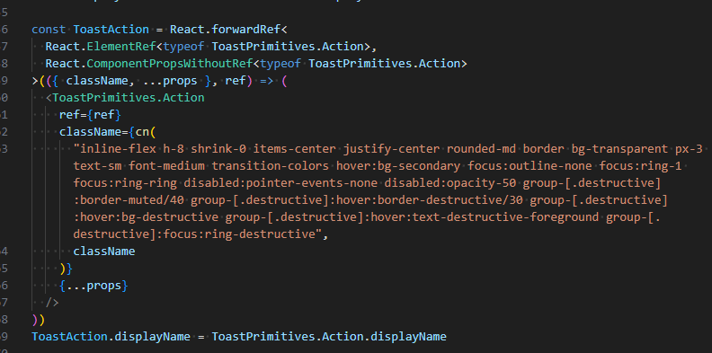

I enjoy reading [Ian Macartney's](https://stack.convex.dev/author/ian-macartney) posts on the Convex blog. When I saw his piece on [Work Stealing](https://stack.convex.dev/work-stealing), a strategy for distributing compute-heavy workloads, I decided to try it myself.

# TL;DR

Check out the demo video below to see what I built:

<iframe width="100%" height="400" src="https://www.youtube.com/embed/sovYE3sWszY" frameborder="0" allow="accelerometer; autoplay; clipboard-write; encrypted-media; gyroscope; picture-in-picture" allowfullscreen></iframe>

Code: [https://github.com/mikecann/whisper-farm](https://github.com/mikecann/whisper-farm)

# Whisper Farm

I aimed to speed up podcast transcription by parallelizing the task into separate "jobs" and performing each in parallel on [Fly.io's GPU machines](https://fly.io/gpu).

Each Fly.io machine runs a single Docker container with a Whisper binary from [whisper-standalone-win](https://github.com/Purfview/whisper-standalone-win), an [FFmpeg](https://github.com/kribblo/node-ffmpeg-installer) binary, and a Node.js "worker" for "chunking" or "transcription" jobs.

To orchestrate this, I used [Convex](https://convex.dev), an excellent backend as a service that I’ve discussed [many times before](https://mikecann.co.uk/tags/convex).

# Challenges

This project was more challenging than I initially thought.

Most difficulties were related to Docker and Fly.io, while the Convex part was problem-free.

## Docker

Not being a Docker expert caused several headaches when packaging the Whisper model and code.

I started off in high hopes after reading [this blog post](https://fly.io/blog/transcribing-on-fly-gpu-machines/) from Fly. However, I soon realized I didn't want to run it as a standalone container. Instead, I wanted my worker code to run alongside it, simplifying scaling and cost management. I wanted a self-contained worker.

Merging two Dockerfiles turned out to be complex. Eventually, I abandoned that approach and used a [Whisper binary](https://github.com/Purfview/whisper-standalone-win), dynamically downloading and unzipping it when the container was constructed.

Another issue was the large Docker image size, around 15 GB, causing problems on Fly.io. Machines wouldn't start or took a long time, likely due to the image size. Fly.io's error messages weren't helpful here.

To reduce the Docker image size, I learned (thanks, ChatGPT!) that each "RUN" command creates a new layer. By rearranging and combining "RUN" commands, I reduced the image size from 15 GB to 5 GB.

This experience taught me that I probably need to learn a bit more about Docker fundamentals.

# UI - Shadcn & Tailwind

Another side quest was experimenting with "the new hotness" in web UI design.

[Shadcn/ui](https://ui.shadcn.com/) is popular right now. The idea is to copy and paste component code directly into your project and modify it, creating your own component library.

Shadcn uses Tailwind for styling. Although I’ve avoided Tailwind due to its "[stringly typed](https://wiki.c2.com/?StringlyTyped)" nature, I decided to try it since it’s widely used.

My conclusions?

I’m just not sold on Tailwind. I dislike its stringly typed nature and the need for additional tools like `prettier-plugin-tailwindcss` and extra linting rules. Managing className attributes requires more libraries like `tailwind-merge` and `class-variance-authority` which irks me. Tailwind also needs its own compiler/toolchain which is yet another headache to deal with.

Shadcn/ui was also disappointing. While the copy-paste nature is quick, the components lacked features I expected from a UI library. Modifying components that often looked like this is just simply confusing:

# Issues and Future Work

Back to the main point of this post.

I think I proved the concept of work-stealing and learned a lot along the way. There is however more work that would be needed to take this further.

Some key areas include:

- Transcription results might exceed the 1 MB row limit in the database (https://docs.convex.dev/production/state/limits), so storing it as a file might be necessary.
- Error handling for Fly.io machine startup needs improvement.
- More testing is required to ensure stability.
- The code is messy and needs tidying up.
- There’s no authorization or authentication.
- Worker count limits are needed to prevent potential issues.
- The UI is basic and was more of an experiment with Shadcn and Tailwind.
